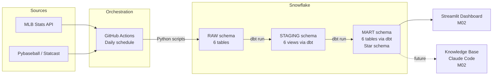

# Baseball Operations Analyst — MLB Player Performance Analytics

End-to-end analytics engineering project: MLB player performance data extracted from public APIs, loaded into Snowflake, transformed via dbt into a star schema, and visualized in Streamlit.

Built as a portfolio project for ISBA 4715 (capstone), targeting a Baseball Operations Analyst role.

## Pipeline

## Tech Stack

| Layer | Tool |
|---|---|
| Warehouse | Snowflake |
| Transformation | dbt (staging + mart layers) |
| Extraction | Python — MLB-StatsAPI, pybaseball |
| Orchestration | GitHub Actions |
| Dashboard | Streamlit (M02) |

## Data Scope

- **Seasons:** 2024–2025 (Statcast era), refreshable via workflow dispatch
- **Sources:** MLB Stats API (rosters, games, stats) + Baseball Savant / Statcast (pitch-level metrics)
- **Star Schema:** 4 dimensions (players, teams, seasons, games) + 2 facts (game stats, season stats)

## Local Setup

1. Clone the repo and create a virtual environment
2. Copy `.env.example` to `.env` and fill in Snowflake credentials
3. Run `extract/setup_snowflake.sql` in Snowflake to create database objects
4. `pip install -r requirements.txt`
5. Run extraction scripts: `python -m extract.teams`, etc.
6. Set up `~/.dbt/profiles.yml` for the `baseball_analytics` profile
7. `cd dbt && dbt deps && dbt run && dbt test`
