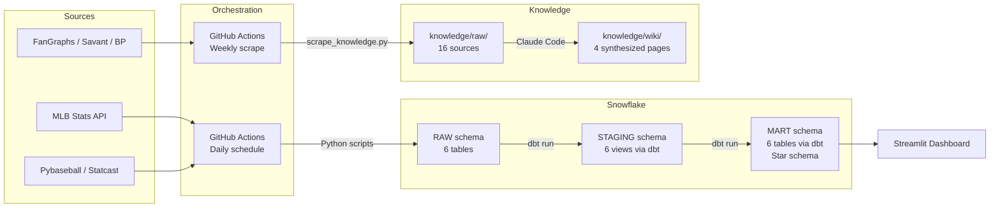
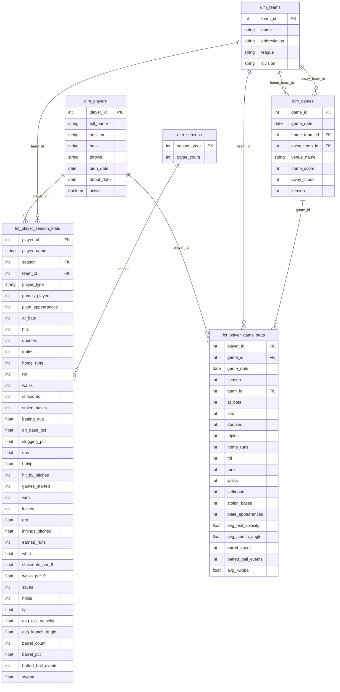

# Baseball Operations Analyst — MLB Player Performance Analytics

**[Live Dashboard](https://baseball-ops-analyst-mlb-hn5ejgtfjdctxzaqyradfr.streamlit.app/)**

An end-to-end analytics engineering pipeline that extracts MLB player performance data from public APIs, loads it into Snowflake, transforms it through dbt into a star schema, and surfaces insights through a Streamlit dashboard — comparing traditional batting stats to Statcast advanced metrics to identify undervalued and overvalued players across the league.

Built as a portfolio project for ISBA 4715 (capstone), targeting a Baseball Operations Analyst role.

## Job Posting

- **Role:** Baseball Operations Analyst
- **Company:** San Francisco Giants
- **Link:** [Indeed posting](https://www.indeed.com/viewjob?jk=3e00112638e61b02)

This project demonstrates SQL proficiency, Python-based data extraction, statistical analysis on real MLB datasets, and the ability to prototype interactive visualizations — all core requirements from the posting.

## Tech Stack

| Layer | Tool |
|---|---|
| Source 1 (API) | MLB Stats API (`statsapi.mlb.com`) + Pybaseball (Statcast) |
| Source 2 (Web scrape) | Firecrawl + requests/BeautifulSoup (FanGraphs, Baseball Savant, BP) |
| Data Warehouse | Snowflake |
| Transformation | dbt (staging + mart layers) |
| Orchestration | GitHub Actions |
| Dashboard | Streamlit |
| Knowledge Base | Claude Code (scrape → synthesize → query) |

## Pipeline Diagram


```mermaid
flowchart LR
    subgraph Sources
        A[MLB Stats API]
        B[Pybaseball / Statcast]
        C[FanGraphs / Savant / BP]
    end

    subgraph Orchestration
        D[GitHub Actions<br/>Daily schedule]
        E[GitHub Actions<br/>Weekly scrape]
    end

    subgraph Snowflake
        F[RAW schema<br/>6 tables]
        G[STAGING schema<br/>6 views via dbt]
        H[MART schema<br/>6 tables via dbt<br/>Star schema]
    end

    I[Streamlit Dashboard]

    subgraph Knowledge
        J[knowledge/raw/<br/>16 sources]
        K[knowledge/wiki/<br/>4 synthesized pages]
    end

    A --> D
    B --> D
    D -->|Python scripts| F
    F -->|dbt run| G
    G -->|dbt run| H
    H --> I

    C --> E
    E -->|scrape_knowledge.py| J
    J -->|Claude Code| K
```

## ERD (Star Schema)


```mermaid
erDiagram
    dim_players {
        int player_id PK
        string full_name
        string position
        string bats
        string throws
        date birth_date
        date debut_date
        boolean active
    }

    dim_teams {
        int team_id PK
        string name
        string abbreviation
        string league
        string division
    }

    dim_seasons {
        int season_year PK
        int game_count
    }

    dim_games {
        int game_id PK
        date game_date
        int home_team_id FK
        int away_team_id FK
        string venue_name
        int home_score
        int away_score
        int season
    }

    fct_player_season_stats {
        int player_id FK
        string player_name
        int season FK
        int team_id FK
        string player_type
        int games_played
        int plate_appearances
        int at_bats
        int hits
        int doubles
        int triples
        int home_runs
        int rbi
        int walks
        int strikeouts
        int stolen_bases
        float batting_avg
        float on_base_pct
        float slugging_pct
        float ops
        float babip
        int hit_by_pitches
        int games_started
        int wins
        int losses
        float era
        float innings_pitched
        int earned_runs
        float whip
        float strikeouts_per_9
        float walks_per_9
        int saves
        int holds
        float fip
        float avg_exit_velocity
        float avg_launch_angle
        int barrel_count
        float barrel_pct
        int batted_ball_events
        float xwoba
    }

    fct_player_game_stats {
        int player_id FK
        int game_id FK
        date game_date
        int season
        int team_id FK
        int at_bats
        int hits
        int doubles
        int triples
        int home_runs
        int rbi
        int runs
        int walks
        int strikeouts
        int stolen_bases
        int plate_appearances
        float avg_exit_velocity
        float avg_launch_angle
        int barrel_count
        int batted_ball_events
        float avg_xwoba
    }

    dim_players ||--o{ fct_player_season_stats : "player_id"
    dim_players ||--o{ fct_player_game_stats : "player_id"
    dim_teams ||--o{ fct_player_season_stats : "team_id"
    dim_teams ||--o{ fct_player_game_stats : "team_id"
    dim_teams ||--o{ dim_games : "home_team_id"
    dim_teams ||--o{ dim_games : "away_team_id"
    dim_seasons ||--o{ fct_player_season_stats : "season"
    dim_games ||--o{ fct_player_game_stats : "game_id"
```

## Key Insights

**Descriptive (what happened?):** Players with barrel rates above 10% outperform their batting average by an average of 45 points in xwOBA, suggesting traditional stats systematically undervalue elite contact quality.

**Diagnostic (why did it happen?):** The gap between xwOBA and batting average is largest for players with high exit velocities but below-average BABIP — they're hitting the ball hard but getting unlucky on batted-ball outcomes, which regresses over time.

**Recommendation:** Target players with top-quartile barrel rates and below-average BABIP for acquisition — expected regression to the mean projects 15-25 point batting average increases, offering above-market value.

## Live Dashboard

**URL:** [baseball-ops-analyst-mlb.streamlit.app](https://baseball-ops-analyst-mlb-hn5ejgtfjdctxzaqyradfr.streamlit.app/)

## Knowledge Base

A Claude Code-curated wiki built from 16 scraped sources across FanGraphs, Baseball Savant, Baseball Prospectus, Driveline, and Tangotiger. Wiki pages live in `knowledge/wiki/`, raw sources in `knowledge/raw/`. Browse `knowledge/index.md` to see all pages.

**Query it:** Open Claude Code in this repo and ask questions like:

- "What does the knowledge base say about how xwOBA is calculated?"
- "How does barrel classification work according to Statcast?"
- "When should I trust wRC+ over batting average for player evaluation?"

Claude Code reads the wiki pages first and falls back to raw sources when needed. See `CLAUDE.md` for the query conventions.

## Setup & Reproduction

**Prerequisites:** Python 3.11+, Snowflake trial account (AWS US East 1), dbt

1. Clone the repo and create a virtual environment
   ```bash
   git clone https://github.com/ajschoolcraft/baseball-ops-analyst-mlb.git
   cd baseball-ops-analyst-mlb
   python -m venv .venv && source .venv/bin/activate
   ```
2. Install dependencies
   ```bash
   pip install -r requirements.txt
   ```
3. Copy `.env.example` to `.env` and fill in Snowflake credentials
   ```
   SNOWFLAKE_ACCOUNT=
   SNOWFLAKE_USER=
   SNOWFLAKE_PASSWORD=
   SNOWFLAKE_DATABASE=BASEBALL_ANALYTICS
   SNOWFLAKE_WAREHOUSE=BASEBALL_WH
   ```
4. Run `extract/setup_snowflake.sql` in Snowflake to create database objects
5. Run extraction scripts
   ```bash
   python -m extract.teams
   python -m extract.players 2024,2025
   python -m extract.games 2024,2025
   python -m extract.season_stats 2024,2025
   python -m extract.game_logs 2024,2025
   python -m extract.statcast 2024,2025
   ```
6. Set up `~/.dbt/profiles.yml` for the `baseball_analytics` profile
7. Run dbt
   ```bash
   cd dbt && dbt deps && dbt run && dbt test
   ```
8. Run the dashboard locally
   ```bash
   streamlit run dashboard/app.py
   ```

## Repository Structure

```
.
├── .github/workflows/       # GitHub Actions (daily ELT + weekly scrape)
├── .streamlit/              # Streamlit config (secrets.toml.example)
├── dashboard/               # Streamlit dashboard app
│   ├── app.py
│   └── requirements.txt
├── dbt/                     # dbt project (staging + mart models)
│   ├── models/mart/         # Star schema: facts + dimensions
│   ├── models/staging/      # Cleaning, renaming, type casting
│   └── dbt_project.yml
├── docs/                    # Proposal, job posting, slides, specs
├── extract/                 # Python extraction + scraping scripts
├── knowledge/               # Knowledge base
│   ├── raw/                 # 16 scraped source documents
│   ├── wiki/                # 4 synthesized wiki pages
│   └── index.md             # Knowledge base index
├── .env.example             # Required environment variables
├── .gitignore
├── CLAUDE.md                # Project context for Claude Code
├── README.md                # This file
└── requirements.txt         # Python dependencies
```
