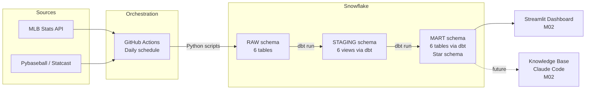

# M01: Extract, Load & Transform — Implementation Plan

> **For agentic workers:** REQUIRED SUB-SKILL: Use superpowers:subagent-driven-development (recommended) or superpowers:executing-plans to implement this plan task-by-task. Steps use checkbox (`- [ ]`) syntax for tracking.

**Goal:** Build the end-to-end data pipeline — Python scripts extract from MLB Stats API and pybaseball, load to Snowflake RAW schema, dbt transforms through staging views into a mart star schema (4 dimensions, 2 facts), GitHub Actions orchestrates daily runs.

**Architecture:** Six Python extraction scripts each target one raw table using full-replace (`DROP TABLE IF EXISTS` + `write_pandas`). dbt staging models (views) clean and rename. dbt mart models (tables) implement the star schema, joining traditional stats with Statcast aggregations. GitHub Actions runs everything sequentially on a daily cron.

**Tech Stack:** Python 3.11, MLB-StatsAPI, pybaseball, snowflake-connector-python, pandas, dbt-snowflake, dbt-utils, GitHub Actions

---

## File Structure

```
requirements.txt                          # All Python + dbt dependencies

extract/
  setup_snowflake.sql                     # One-time DB/schema/warehouse creation
  utils.py                                # Shared Snowflake connection + load helper
  teams.py                                # 30 MLB teams → raw.teams
  players.py                              # All players for loaded seasons → raw.players
  games.py                                # All regular-season games → raw.games
  season_stats.py                         # Per-player season totals → raw.season_stats
  game_logs.py                            # Per-player per-game lines → raw.game_logs
  statcast.py                             # Pitch-level Statcast → raw.statcast

dbt/
  dbt_project.yml
  packages.yml                            # dbt-utils dependency
  macros/
    generate_schema_name.sql              # Route models to STAGING/MART schemas
  models/
    staging/
      _sources.yml                        # Source definitions pointing to RAW schema
      _stg_schema.yml                     # Tests for staging models
      stg_players.sql
      stg_teams.sql
      stg_games.sql
      stg_game_logs.sql
      stg_season_stats.sql
      stg_statcast.sql
    mart/
      _mart_schema.yml                    # Tests for mart models
      dim_players.sql
      dim_teams.sql
      dim_seasons.sql
      dim_games.sql
      fct_player_game_stats.sql
      fct_player_season_stats.sql

.github/
  workflows/
    extract_load.yml                      # Daily cron + manual dispatch
```

---

### Task 1: Project Scaffolding

**Files:**
- Create: `requirements.txt`
- Create: `extract/` directory

- [ ] **Step 1: Create requirements.txt**

```
MLB-StatsAPI>=1.7
pybaseball>=2.2
snowflake-connector-python>=3.0
pandas>=2.0
python-dotenv>=1.0
dbt-snowflake>=1.7
dbt-utils>=1.1
```

- [ ] **Step 2: Create extract directory with __init__.py**

```bash
mkdir -p extract
touch extract/__init__.py
```

- [ ] **Step 3: Verify .env has required variables**

Check that `.env` (already gitignored) contains these keys — values will differ per environment:

```
SNOWFLAKE_ACCOUNT=...
SNOWFLAKE_USER=...
SNOWFLAKE_PASSWORD=...
SNOWFLAKE_DATABASE=BASEBALL_ANALYTICS
SNOWFLAKE_WAREHOUSE=BASEBALL_WH
```

Run: `grep -c 'SNOWFLAKE' .env`
Expected: `5` (all five variables present)

- [ ] **Step 4: Commit**

```bash
git add requirements.txt extract/
git commit -m "Add project dependencies and extract directory for M01 pipeline"
```

---

### Task 2: Snowflake Setup SQL

**Files:**
- Create: `extract/setup_snowflake.sql`

- [ ] **Step 1: Write the setup script**

```sql
-- One-time Snowflake setup. Run manually via Snowflake UI or SnowSQL.
-- This creates the database, schemas, and warehouse for the project.

CREATE DATABASE IF NOT EXISTS BASEBALL_ANALYTICS;

USE DATABASE BASEBALL_ANALYTICS;

CREATE SCHEMA IF NOT EXISTS RAW;
CREATE SCHEMA IF NOT EXISTS STAGING;
CREATE SCHEMA IF NOT EXISTS MART;

CREATE WAREHOUSE IF NOT EXISTS BASEBALL_WH
    WITH WAREHOUSE_SIZE = 'XSMALL'
    AUTO_SUSPEND = 60
    AUTO_RESUME = TRUE;
```

- [ ] **Step 2: Run the setup in Snowflake**

Execute the script via Snowflake worksheet UI or SnowSQL. Verify all three schemas exist:

```sql
SHOW SCHEMAS IN DATABASE BASEBALL_ANALYTICS;
```

Expected: `RAW`, `STAGING`, `MART` (plus default schemas `INFORMATION_SCHEMA`, `PUBLIC`)

- [ ] **Step 3: Commit**

```bash
git add extract/setup_snowflake.sql
git commit -m "Add Snowflake setup SQL for database, schemas, and warehouse"
```

---

### Task 3: Snowflake Connection Utility

**Files:**
- Create: `extract/utils.py`

- [ ] **Step 1: Write utils.py**

```python
import os

import pandas as pd
import snowflake.connector
from dotenv import load_dotenv
from snowflake.connector.pandas_tools import write_pandas

load_dotenv()


def get_connection():
    return snowflake.connector.connect(
        account=os.environ["SNOWFLAKE_ACCOUNT"],
        user=os.environ["SNOWFLAKE_USER"],
        password=os.environ["SNOWFLAKE_PASSWORD"],
        database=os.environ.get("SNOWFLAKE_DATABASE", "BASEBALL_ANALYTICS"),
        warehouse=os.environ.get("SNOWFLAKE_WAREHOUSE", "BASEBALL_WH"),
    )


def load_to_snowflake(df, table_name, schema="RAW"):
    conn = get_connection()
    try:
        cursor = conn.cursor()
        database = os.environ.get("SNOWFLAKE_DATABASE", "BASEBALL_ANALYTICS")
        cursor.execute(f"DROP TABLE IF EXISTS {database}.{schema}.{table_name}")
        write_pandas(
            conn,
            df,
            table_name,
            schema=schema,
            database=database,
            auto_create_table=True,
        )
        print(f"Loaded {len(df)} rows to {schema}.{table_name}")
    finally:
        conn.close()
```

- [ ] **Step 2: Verify connection works**

```bash
cd /Users/ajschoolcraft/isba-4715/baseball-ops-analyst-mlb
.venv/bin/python -c "
from extract.utils import get_connection
conn = get_connection()
cursor = conn.cursor()
cursor.execute('SELECT CURRENT_ACCOUNT(), CURRENT_DATABASE(), CURRENT_WAREHOUSE()')
print(cursor.fetchone())
conn.close()
print('Connection OK')
"
```

Expected: prints account, database, warehouse names and `Connection OK`

- [ ] **Step 3: Commit**

```bash
git add extract/utils.py
git commit -m "Add Snowflake connection utility with load helper"
```

---

### Task 4: Teams Extraction

**Files:**
- Create: `extract/teams.py`

- [ ] **Step 1: Write teams.py**

```python
import pandas as pd
import statsapi

from extract.utils import load_to_snowflake


def extract_teams():
    data = statsapi.get("teams", {"sportId": 1})
    teams = []
    for t in data["teams"]:
        teams.append(
            {
                "team_id": t["id"],
                "name": t["name"],
                "abbreviation": t["abbreviation"],
                "league": t["league"]["name"],
                "division": t["division"]["name"],
            }
        )
    df = pd.DataFrame(teams)
    print(f"Extracted {len(df)} teams")
    load_to_snowflake(df, "TEAMS")


if __name__ == "__main__":
    extract_teams()
```

- [ ] **Step 2: Run and verify**

```bash
.venv/bin/python -m extract.teams
```

Expected: `Extracted 30 teams` and `Loaded 30 rows to RAW.TEAMS`

Verify in Snowflake:

```sql
SELECT COUNT(*) FROM BASEBALL_ANALYTICS.RAW.TEAMS;
SELECT * FROM BASEBALL_ANALYTICS.RAW.TEAMS LIMIT 5;
```

- [ ] **Step 3: Commit**

```bash
git add extract/teams.py
git commit -m "Add teams extraction script (30 MLB teams → raw.teams)"
```

---

### Task 5: Players Extraction

**Files:**
- Create: `extract/players.py`

- [ ] **Step 1: Write players.py**

```python
import sys

import pandas as pd
import statsapi

from extract.utils import load_to_snowflake

DEFAULT_SEASONS = [2024, 2025]


def extract_players(seasons=None):
    seasons = seasons or DEFAULT_SEASONS
    all_players = []
    for season in seasons:
        data = statsapi.get("sports_players", {"sportId": 1, "season": season})
        for p in data["people"]:
            all_players.append(
                {
                    "player_id": p["id"],
                    "full_name": p["fullName"],
                    "position": p["primaryPosition"]["abbreviation"],
                    "bats": p.get("batSide", {}).get("code"),
                    "throws": p.get("pitchHand", {}).get("code"),
                    "birth_date": p.get("birthDate"),
                    "debut_date": p.get("mlbDebutDate"),
                    "active": p.get("active", False),
                    "team_id": p.get("currentTeam", {}).get("id"),
                    "season": season,
                }
            )
        print(f"  {season}: {len(data['people'])} players")

    df = pd.DataFrame(all_players)
    df = df.drop_duplicates(subset=["player_id", "season"])
    print(f"Extracted {len(df)} total player-season records")
    load_to_snowflake(df, "PLAYERS")


if __name__ == "__main__":
    seasons = [int(s) for s in sys.argv[1].split(",")] if len(sys.argv) > 1 else None
    extract_players(seasons)
```

- [ ] **Step 2: Run and verify**

```bash
.venv/bin/python -m extract.players
```

Expected: ~1400-1500 players per season, ~2800-3000 total player-season records

Verify in Snowflake:

```sql
SELECT season, COUNT(*) FROM BASEBALL_ANALYTICS.RAW.PLAYERS GROUP BY season;
```

- [ ] **Step 3: Commit**

```bash
git add extract/players.py
git commit -m "Add players extraction script (all MLB players for loaded seasons)"
```

---

### Task 6: Games Extraction

**Files:**
- Create: `extract/games.py`

- [ ] **Step 1: Write games.py**

```python
import sys

import pandas as pd
import statsapi

from extract.utils import load_to_snowflake

DEFAULT_SEASONS = [2024, 2025]


def extract_games(seasons=None):
    seasons = seasons or DEFAULT_SEASONS
    all_games = []
    for season in seasons:
        schedule = statsapi.schedule(
            start_date=f"03/01/{season}",
            end_date=f"11/30/{season}",
            sportId=1,
        )
        for g in schedule:
            if g["game_type"] != "R":
                continue
            if g["status"] != "Final":
                continue
            all_games.append(
                {
                    "game_id": g["game_id"],
                    "game_date": g["game_date"],
                    "game_type": g["game_type"],
                    "home_team_id": g["home_id"],
                    "away_team_id": g["away_id"],
                    "home_score": g["home_score"],
                    "away_score": g["away_score"],
                    "venue_name": g["venue_name"],
                    "status": g["status"],
                    "season": season,
                }
            )
        print(f"  {season}: {len([g for g in all_games if g['season'] == season])} games")

    df = pd.DataFrame(all_games)
    print(f"Extracted {len(df)} total games")
    load_to_snowflake(df, "GAMES")


if __name__ == "__main__":
    seasons = [int(s) for s in sys.argv[1].split(",")] if len(sys.argv) > 1 else None
    extract_games(seasons)
```

- [ ] **Step 2: Run and verify**

```bash
.venv/bin/python -m extract.games
```

Expected: ~2400-2430 games per full season

Verify in Snowflake:

```sql
SELECT season, COUNT(*) FROM BASEBALL_ANALYTICS.RAW.GAMES GROUP BY season;
```

- [ ] **Step 3: Commit**

```bash
git add extract/games.py
git commit -m "Add games extraction script (regular-season games → raw.games)"
```

---

### Task 7: Season Stats Extraction

**Files:**
- Create: `extract/season_stats.py`

- [ ] **Step 1: Write season_stats.py**

The MLB Stats API `stats` endpoint supports bulk retrieval of all players' season stats with pagination.

```python
import sys

import pandas as pd
import statsapi

from extract.utils import load_to_snowflake

DEFAULT_SEASONS = [2024, 2025]


def fetch_stats(season, group):
    all_splits = []
    offset = 0
    limit = 1000
    while True:
        data = statsapi.get(
            "stats",
            {
                "stats": "season",
                "group": group,
                "season": season,
                "sportId": 1,
                "limit": limit,
                "offset": offset,
            },
        )
        splits = data["stats"][0]["splits"]
        all_splits.extend(splits)
        if len(splits) < limit:
            break
        offset += limit
    return all_splits


def parse_hitting(splits, season):
    rows = []
    for s in splits:
        stat = s["stat"]
        rows.append(
            {
                "player_id": s["player"]["id"],
                "player_name": s["player"]["fullName"],
                "season": int(s["season"]),
                "team_id": s["team"]["id"],
                "player_type": "batter",
                "games_played": stat.get("gamesPlayed"),
                "plate_appearances": stat.get("plateAppearances"),
                "at_bats": stat.get("atBats"),
                "hits": stat.get("hits"),
                "doubles": stat.get("doubles"),
                "triples": stat.get("triples"),
                "home_runs": stat.get("homeRuns"),
                "rbi": stat.get("rbi"),
                "walks": stat.get("baseOnBalls"),
                "strikeouts": stat.get("strikeOuts"),
                "stolen_bases": stat.get("stolenBases"),
                "hit_by_pitches": stat.get("hitByPitch"),
                "avg": stat.get("avg"),
                "obp": stat.get("obp"),
                "slg": stat.get("slg"),
                "ops": stat.get("ops"),
                "babip": stat.get("babip"),
                # Pitching columns null for batters
                "games_started": None,
                "wins": None,
                "losses": None,
                "era": None,
                "innings_pitched": None,
                "earned_runs": None,
                "whip": None,
                "strikeouts_per_9": None,
                "walks_per_9": None,
                "saves": None,
                "holds": None,
            }
        )
    return rows


def parse_pitching(splits, season):
    rows = []
    for s in splits:
        stat = s["stat"]
        rows.append(
            {
                "player_id": s["player"]["id"],
                "player_name": s["player"]["fullName"],
                "season": int(s["season"]),
                "team_id": s["team"]["id"],
                "player_type": "pitcher",
                "games_played": stat.get("gamesPlayed"),
                "plate_appearances": None,
                "at_bats": None,
                # For pitchers these are "allowed/recorded" stats (used by FIP)
                "hits": stat.get("hits"),
                "doubles": None,
                "triples": None,
                "home_runs": stat.get("homeRuns"),
                "rbi": None,
                "walks": stat.get("baseOnBalls"),
                "strikeouts": stat.get("strikeOuts"),
                "stolen_bases": None,
                "hit_by_pitches": stat.get("hitBatsmen"),
                "avg": None,
                "obp": None,
                "slg": None,
                "ops": None,
                "babip": None,
                # Pitching columns
                "games_started": stat.get("gamesStarted"),
                "wins": stat.get("wins"),
                "losses": stat.get("losses"),
                "era": stat.get("era"),
                "innings_pitched": stat.get("inningsPitched"),
                "earned_runs": stat.get("earnedRuns"),
                "whip": stat.get("whip"),
                "strikeouts_per_9": stat.get("strikeoutsPer9Inn"),
                "walks_per_9": stat.get("walksPer9Inn"),
                "saves": stat.get("saves"),
                "holds": stat.get("holds"),
            }
        )
    return rows


def extract_season_stats(seasons=None):
    seasons = seasons or DEFAULT_SEASONS
    all_rows = []
    for season in seasons:
        hitting = fetch_stats(season, "hitting")
        pitching = fetch_stats(season, "pitching")
        all_rows.extend(parse_hitting(hitting, season))
        all_rows.extend(parse_pitching(pitching, season))
        print(f"  {season}: {len(hitting)} batters, {len(pitching)} pitchers")

    df = pd.DataFrame(all_rows)
    print(f"Extracted {len(df)} total season stat records")
    load_to_snowflake(df, "SEASON_STATS")


if __name__ == "__main__":
    seasons = [int(s) for s in sys.argv[1].split(",")] if len(sys.argv) > 1 else None
    extract_season_stats(seasons)
```

- [ ] **Step 2: Run and verify**

```bash
.venv/bin/python -m extract.season_stats
```

Expected: ~500-700 batters + ~300-500 pitchers per season

Verify in Snowflake:

```sql
SELECT season, player_type, COUNT(*)
FROM BASEBALL_ANALYTICS.RAW.SEASON_STATS
GROUP BY season, player_type
ORDER BY season, player_type;
```

- [ ] **Step 3: Commit**

```bash
git add extract/season_stats.py
git commit -m "Add season stats extraction (batting + pitching totals → raw.season_stats)"
```

---

### Task 8: Game Logs Extraction

**Files:**
- Create: `extract/game_logs.py`

This is the most API-intensive script. It fetches per-player game logs using the `people` endpoint with `hydrate` parameter. Players are split by position: non-pitchers get hitting logs, pitchers get pitching logs, two-way players get both.

**Expected runtime:** ~10-20 minutes per season (one API call per player).

- [ ] **Step 1: Write game_logs.py**

```python
import sys
import time

import pandas as pd
import statsapi

from extract.utils import load_to_snowflake

DEFAULT_SEASONS = [2024, 2025]


def get_player_ids_with_positions(season):
    data = statsapi.get("sports_players", {"sportId": 1, "season": season})
    return [(p["id"], p["primaryPosition"]["abbreviation"]) for p in data["people"]]


def fetch_game_logs(player_id, season, group):
    try:
        data = statsapi.get(
            "people",
            {
                "personIds": player_id,
                "hydrate": f"stats(group=[{group}],type=[gameLog],season={season})",
            },
        )
        person = data["people"][0]
        stats_list = person.get("stats", [])
        if not stats_list:
            return []
        return stats_list[0].get("splits", [])
    except Exception as e:
        print(f"    Warning: failed for player {player_id} ({group}): {e}")
        return []


def parse_hitting_log(split, player_id):
    stat = split["stat"]
    return {
        "player_id": player_id,
        "player_name": split["player"]["fullName"],
        "game_id": split["game"]["gamePk"],
        "game_date": split["date"],
        "season": int(split["season"]),
        "team_id": split["team"]["id"],
        "player_type": "batter",
        "at_bats": stat.get("atBats"),
        "hits": stat.get("hits"),
        "doubles": stat.get("doubles"),
        "triples": stat.get("triples"),
        "home_runs": stat.get("homeRuns"),
        "rbi": stat.get("rbi"),
        "runs": stat.get("runs"),
        "walks": stat.get("baseOnBalls"),
        "strikeouts": stat.get("strikeOuts"),
        "stolen_bases": stat.get("stolenBases"),
        "plate_appearances": stat.get("plateAppearances"),
        # Pitching columns null for batters
        "innings_pitched": None,
        "earned_runs": None,
        "pitching_strikeouts": None,
        "pitching_walks": None,
        "pitching_hits": None,
        "pitching_home_runs": None,
        "pitches": None,
        "wins": None,
        "losses": None,
    }


def parse_pitching_log(split, player_id):
    stat = split["stat"]
    return {
        "player_id": player_id,
        "player_name": split["player"]["fullName"],
        "game_id": split["game"]["gamePk"],
        "game_date": split["date"],
        "season": int(split["season"]),
        "team_id": split["team"]["id"],
        "player_type": "pitcher",
        # Batting columns null for pitchers
        "at_bats": None,
        "hits": None,
        "doubles": None,
        "triples": None,
        "home_runs": None,
        "rbi": None,
        "runs": None,
        "walks": None,
        "strikeouts": None,
        "stolen_bases": None,
        "plate_appearances": None,
        # Pitching columns
        "innings_pitched": stat.get("inningsPitched"),
        "earned_runs": stat.get("earnedRuns"),
        "pitching_strikeouts": stat.get("strikeOuts"),
        "pitching_walks": stat.get("baseOnBalls"),
        "pitching_hits": stat.get("hits"),
        "pitching_home_runs": stat.get("homeRuns"),
        "pitches": stat.get("numberOfPitches"),
        "wins": stat.get("wins"),
        "losses": stat.get("losses"),
    }


def extract_game_logs(seasons=None):
    seasons = seasons or DEFAULT_SEASONS
    all_rows = []

    for season in seasons:
        players = get_player_ids_with_positions(season)
        print(f"  {season}: processing {len(players)} players...")

        for i, (pid, pos) in enumerate(players):
            if pos == "TWP":
                for split in fetch_game_logs(pid, season, "hitting"):
                    all_rows.append(parse_hitting_log(split, pid))
                for split in fetch_game_logs(pid, season, "pitching"):
                    all_rows.append(parse_pitching_log(split, pid))
            elif pos == "P":
                for split in fetch_game_logs(pid, season, "pitching"):
                    all_rows.append(parse_pitching_log(split, pid))
            else:
                for split in fetch_game_logs(pid, season, "hitting"):
                    all_rows.append(parse_hitting_log(split, pid))

            if (i + 1) % 100 == 0:
                print(f"    {i + 1}/{len(players)} players processed")
            time.sleep(0.1)

        print(f"  {season}: {len([r for r in all_rows if r['season'] == season])} game log rows")

    df = pd.DataFrame(all_rows)
    print(f"Extracted {len(df)} total game log records")
    load_to_snowflake(df, "GAME_LOGS")


if __name__ == "__main__":
    seasons = [int(s) for s in sys.argv[1].split(",")] if len(sys.argv) > 1 else None
    extract_game_logs(seasons)
```

- [ ] **Step 2: Test with a single season first**

```bash
.venv/bin/python -m extract.game_logs 2025
```

Expected: ~100,000-200,000 game log rows for one season. Runtime: ~10-20 minutes.

- [ ] **Step 3: Run full extraction (both seasons)**

```bash
.venv/bin/python -m extract.game_logs
```

Verify in Snowflake:

```sql
SELECT season, player_type, COUNT(*)
FROM BASEBALL_ANALYTICS.RAW.GAME_LOGS
GROUP BY season, player_type
ORDER BY season, player_type;
```

- [ ] **Step 4: Commit**

```bash
git add extract/game_logs.py
git commit -m "Add game logs extraction (per-player per-game stats → raw.game_logs)"
```

---

### Task 9: Statcast Extraction

**Files:**
- Create: `extract/statcast.py`

Uses pybaseball's `statcast()` function, chunked by month to avoid timeouts. Selects key columns relevant to the star schema (exit velocity, launch angle, xwOBA, barrel classification, bat tracking).

**Expected runtime:** ~5-10 minutes per season.

- [ ] **Step 1: Write statcast.py**

```python
import calendar
import sys

import pandas as pd
from pybaseball import statcast

from extract.utils import load_to_snowflake

DEFAULT_SEASONS = [2024, 2025]

COLUMNS = [
    "game_pk",
    "game_date",
    "game_year",
    "batter",
    "pitcher",
    "player_name",
    "events",
    "description",
    "bb_type",
    "stand",
    "p_throws",
    "home_team",
    "away_team",
    "pitch_type",
    "pitch_name",
    "release_speed",
    "release_spin_rate",
    "effective_speed",
    "launch_speed",
    "launch_angle",
    "launch_speed_angle",
    "hit_distance_sc",
    "estimated_ba_using_speedangle",
    "estimated_woba_using_speedangle",
    "woba_value",
    "woba_denom",
    "babip_value",
    "iso_value",
    "bat_speed",
    "swing_length",
    "at_bat_number",
    "pitch_number",
]


def extract_statcast(seasons=None):
    seasons = seasons or DEFAULT_SEASONS
    all_chunks = []

    for season in seasons:
        for month in range(3, 12):
            last_day = calendar.monthrange(season, month)[1]
            start = f"{season}-{month:02d}-01"
            end = f"{season}-{month:02d}-{last_day}"
            print(f"  Fetching {start} to {end}...")
            try:
                df = statcast(start_dt=start, end_dt=end)
                if df is not None and len(df) > 0:
                    available = [c for c in COLUMNS if c in df.columns]
                    chunk = df[available].copy()
                    all_chunks.append(chunk)
                    print(f"    {len(chunk)} pitches")
                else:
                    print(f"    0 pitches")
            except Exception as e:
                print(f"    Warning: failed for {start}: {e}")

    if not all_chunks:
        print("No Statcast data extracted")
        return

    df = pd.concat(all_chunks, ignore_index=True)

    for col in df.select_dtypes(include=["Int64"]).columns:
        df[col] = df[col].astype("float64")
    for col in df.select_dtypes(include=["Float64"]).columns:
        df[col] = df[col].astype("float64")

    print(f"Extracted {len(df)} total Statcast pitches")
    load_to_snowflake(df, "STATCAST")


if __name__ == "__main__":
    seasons = [int(s) for s in sys.argv[1].split(",")] if len(sys.argv) > 1 else None
    extract_statcast(seasons)
```

- [ ] **Step 2: Test with one season**

```bash
.venv/bin/python -m extract.statcast 2025
```

Expected: ~700,000-800,000 pitches per season

- [ ] **Step 3: Run full extraction**

```bash
.venv/bin/python -m extract.statcast
```

Verify in Snowflake:

```sql
SELECT game_year, COUNT(*) FROM BASEBALL_ANALYTICS.RAW.STATCAST GROUP BY game_year;
```

- [ ] **Step 4: Commit**

```bash
git add extract/statcast.py
git commit -m "Add Statcast extraction (pitch-level data chunked by month → raw.statcast)"
```

---

### Task 10: dbt Project Configuration

**Files:**
- Create: `dbt/dbt_project.yml`
- Create: `dbt/packages.yml`
- Create: `dbt/macros/generate_schema_name.sql`
- Create: `dbt/models/staging/_sources.yml`

- [ ] **Step 1: Create directory structure**

```bash
mkdir -p dbt/macros dbt/models/staging dbt/models/mart
```

- [ ] **Step 2: Write dbt_project.yml**

```yaml
name: 'baseball_analytics'
version: '1.0.0'

profile: 'baseball_analytics'

model-paths: ["models"]
macro-paths: ["macros"]

models:
  baseball_analytics:
    staging:
      +materialized: view
      +schema: STAGING
    mart:
      +materialized: table
      +schema: MART
```

- [ ] **Step 3: Write packages.yml**

```yaml
packages:
  - package: dbt-labs/dbt_utils
    version: [">=1.1.0", "<2.0.0"]
```

- [ ] **Step 4: Write generate_schema_name macro**

This macro ensures models go to the exact schema specified (STAGING, MART) instead of dbt's default behavior of prepending the target schema.

`dbt/macros/generate_schema_name.sql`:

```sql

    
        {{ target.schema }}
    
        {{ custom_schema_name | trim }}
    

```

- [ ] **Step 5: Write source definitions**

`dbt/models/staging/_sources.yml`:

```yaml
version: 2

sources:
  - name: baseball_raw
    database: BASEBALL_ANALYTICS
    schema: RAW
    tables:
      - name: PLAYERS
      - name: TEAMS
      - name: GAMES
      - name: GAME_LOGS
      - name: SEASON_STATS
      - name: STATCAST
```

- [ ] **Step 6: Set up local dbt profile**

Create `~/.dbt/profiles.yml` (NOT committed — contains connection info):

```yaml
baseball_analytics:
  target: dev
  outputs:
    dev:
      type: snowflake
      account: "{{ env_var('SNOWFLAKE_ACCOUNT') }}"
      user: "{{ env_var('SNOWFLAKE_USER') }}"
      password: "{{ env_var('SNOWFLAKE_PASSWORD') }}"
      database: BASEBALL_ANALYTICS
      warehouse: BASEBALL_WH
      schema: PUBLIC
      threads: 4
```

Verify:

```bash
cd dbt && ../.venv/bin/dbt debug
```

Expected: all checks pass

- [ ] **Step 7: Install packages**

```bash
cd dbt && ../.venv/bin/dbt deps
```

Expected: `dbt-utils` installed successfully

- [ ] **Step 8: Commit**

```bash
git add dbt/
git commit -m "Add dbt project config, schema macro, source definitions, and dbt-utils"
```

---

### Task 11: dbt Staging Models & Tests

**Files:**
- Create: `dbt/models/staging/stg_players.sql`
- Create: `dbt/models/staging/stg_teams.sql`
- Create: `dbt/models/staging/stg_games.sql`
- Create: `dbt/models/staging/stg_game_logs.sql`
- Create: `dbt/models/staging/stg_season_stats.sql`
- Create: `dbt/models/staging/stg_statcast.sql`
- Create: `dbt/models/staging/_stg_schema.yml`

- [ ] **Step 1: Write stg_players.sql**

```sql
with source as (
    select * from {{ source('baseball_raw', 'PLAYERS') }}
),

renamed as (
    select
        player_id,
        full_name,
        position,
        bats,
        throws,
        try_to_date(birth_date) as birth_date,
        try_to_date(debut_date) as debut_date,
        active,
        team_id,
        season
    from source
    qualify row_number() over (
        partition by player_id
        order by season desc
    ) = 1
)

select * from renamed
```

- [ ] **Step 2: Write stg_teams.sql**

```sql
with source as (
    select * from {{ source('baseball_raw', 'TEAMS') }}
),

renamed as (
    select
        team_id,
        name,
        abbreviation,
        case
            when league ilike '%american%' then 'AL'
            when league ilike '%national%' then 'NL'
            else league
        end as league,
        division
    from source
)

select * from renamed
```

- [ ] **Step 3: Write stg_games.sql**

```sql
with source as (
    select * from {{ source('baseball_raw', 'GAMES') }}
),

renamed as (
    select
        game_id,
        try_to_date(game_date) as game_date,
        game_type,
        home_team_id,
        away_team_id,
        home_score,
        away_score,
        venue_name,
        status,
        season
    from source
)

select * from renamed
```

- [ ] **Step 4: Write stg_game_logs.sql**

```sql
with source as (
    select * from {{ source('baseball_raw', 'GAME_LOGS') }}
),

renamed as (
    select
        player_id,
        game_id,
        try_to_date(game_date) as game_date,
        season,
        team_id,
        player_type,
        at_bats,
        hits,
        doubles,
        triples,
        home_runs,
        rbi,
        runs,
        walks,
        strikeouts,
        stolen_bases,
        plate_appearances,
        innings_pitched::float as innings_pitched,
        earned_runs,
        pitching_strikeouts,
        pitching_walks,
        pitching_hits,
        pitching_home_runs,
        pitches
    from source
)

select * from renamed
```

- [ ] **Step 5: Write stg_season_stats.sql**

```sql
with source as (
    select * from {{ source('baseball_raw', 'SEASON_STATS') }}
),

renamed as (
    select
        player_id,
        player_name,
        season,
        team_id,
        player_type,
        games_played,
        plate_appearances,
        at_bats,
        hits,
        doubles,
        triples,
        home_runs,
        rbi,
        walks,
        strikeouts,
        stolen_bases,
        avg::float as batting_avg,
        obp::float as on_base_pct,
        slg::float as slugging_pct,
        ops::float as ops,
        babip::float as babip,
        hit_by_pitches,
        games_started,
        wins,
        losses,
        era::float as era,
        innings_pitched::float as innings_pitched,
        earned_runs,
        whip::float as whip,
        strikeouts_per_9::float as strikeouts_per_9,
        walks_per_9::float as walks_per_9,
        saves,
        holds
    from source
)

select * from renamed
```

- [ ] **Step 6: Write stg_statcast.sql**

```sql
with source as (
    select * from {{ source('baseball_raw', 'STATCAST') }}
),

renamed as (
    select
        game_pk,
        try_to_date(game_date) as game_date,
        game_year,
        batter as batter_id,
        pitcher as pitcher_id,
        player_name,
        events,
        description,
        bb_type,
        stand,
        p_throws,
        home_team,
        away_team,
        pitch_type,
        pitch_name,
        release_speed,
        release_spin_rate,
        effective_speed,
        launch_speed,
        launch_angle,
        launch_speed_angle,
        hit_distance_sc as hit_distance,
        estimated_woba_using_speedangle as xwoba,
        estimated_ba_using_speedangle as xba,
        woba_value,
        woba_denom,
        bat_speed,
        swing_length
    from source
    where launch_speed is not null
)

select * from renamed
```

- [ ] **Step 7: Write _stg_schema.yml**

```yaml
version: 2

models:
  - name: stg_players
    columns:
      - name: player_id
        tests:
          - unique
          - not_null

  - name: stg_teams
    columns:
      - name: team_id
        tests:
          - unique
          - not_null
      - name: league
        tests:
          - accepted_values:
              values: ['AL', 'NL']

  - name: stg_games
    columns:
      - name: game_id
        tests:
          - unique
          - not_null

  - name: stg_game_logs
    columns:
      - name: player_id
        tests:
          - not_null
      - name: game_id
        tests:
          - not_null
      - name: player_type
        tests:
          - not_null
          - accepted_values:
              values: ['batter', 'pitcher']
    tests:
      - dbt_utils.unique_combination_of_columns:
          combination_of_columns:
            - player_id
            - game_id
            - player_type

  - name: stg_season_stats
    columns:
      - name: player_id
        tests:
          - not_null
      - name: season
        tests:
          - not_null
      - name: player_type
        tests:
          - not_null
          - accepted_values:
              values: ['batter', 'pitcher']
    tests:
      - dbt_utils.unique_combination_of_columns:
          combination_of_columns:
            - player_id
            - season
            - player_type

  - name: stg_statcast
    columns:
      - name: batter_id
        tests:
          - not_null
      - name: game_pk
        tests:
          - not_null
```

- [ ] **Step 8: Run staging models and tests**

```bash
cd dbt && ../.venv/bin/dbt run --select staging && ../.venv/bin/dbt test --select staging
```

Expected: all 6 models created as views, all tests pass

- [ ] **Step 9: Commit**

```bash
git add dbt/models/staging/
git commit -m "Add dbt staging models and tests (6 views in STAGING schema)"
```

---

### Task 12: dbt Mart Dimension Models

**Files:**
- Create: `dbt/models/mart/dim_players.sql`
- Create: `dbt/models/mart/dim_teams.sql`
- Create: `dbt/models/mart/dim_seasons.sql`
- Create: `dbt/models/mart/dim_games.sql`

- [ ] **Step 1: Write dim_players.sql**

```sql
with players as (
    select * from {{ ref('stg_players') }}
)

select
    player_id,
    full_name,
    position,
    bats,
    throws,
    birth_date,
    debut_date,
    active
from players
```

- [ ] **Step 2: Write dim_teams.sql**

```sql
with teams as (
    select * from {{ ref('stg_teams') }}
)

select
    team_id,
    name,
    abbreviation,
    league,
    division
from teams
```

- [ ] **Step 3: Write dim_seasons.sql**

```sql
with games as (
    select * from {{ ref('stg_games') }}
),

season_agg as (
    select
        season as season_year,
        count(*) as game_count
    from games
    group by season
)

select
    season_year,
    game_count
from season_agg
```

- [ ] **Step 4: Write dim_games.sql**

```sql
with games as (
    select * from {{ ref('stg_games') }}
)

select
    game_id,
    game_date,
    home_team_id,
    away_team_id,
    venue_name,
    home_score,
    away_score,
    season
from games
```

- [ ] **Step 5: Run dimension models**

```bash
cd dbt && ../.venv/bin/dbt run --select dim_players dim_teams dim_seasons dim_games
```

Expected: 4 tables created in MART schema

- [ ] **Step 6: Commit**

```bash
git add dbt/models/mart/dim_*.sql
git commit -m "Add dbt mart dimension models (players, teams, seasons, games)"
```

---

### Task 13: dbt Mart Fact Models & Tests

**Files:**
- Create: `dbt/models/mart/fct_player_game_stats.sql`
- Create: `dbt/models/mart/fct_player_season_stats.sql`
- Create: `dbt/models/mart/_mart_schema.yml`

- [ ] **Step 1: Write fct_player_game_stats.sql**

Joins per-game box score stats with Statcast aggregations at the game level.

```sql
with game_logs as (
    select * from {{ ref('stg_game_logs') }}
    where player_type = 'batter'
),

statcast_game as (
    select
        batter_id as player_id,
        game_pk as game_id,
        avg(launch_speed) as avg_exit_velocity,
        avg(launch_angle) as avg_launch_angle,
        count(case when launch_speed_angle = 6 then 1 end) as barrel_count,
        count(*) as batted_ball_events,
        avg(xwoba) as avg_xwoba
    from {{ ref('stg_statcast') }}
    group by batter_id, game_pk
)

select
    gl.player_id,
    gl.game_id,
    gl.game_date,
    gl.season,
    gl.team_id,
    gl.at_bats,
    gl.hits,
    gl.doubles,
    gl.triples,
    gl.home_runs,
    gl.rbi,
    gl.runs,
    gl.walks,
    gl.strikeouts,
    gl.stolen_bases,
    gl.plate_appearances,
    sc.avg_exit_velocity,
    sc.avg_launch_angle,
    sc.barrel_count,
    sc.batted_ball_events,
    sc.avg_xwoba
from game_logs gl
left join statcast_game sc
    on gl.player_id = sc.player_id
    and gl.game_id = sc.game_id
```

- [ ] **Step 2: Write fct_player_season_stats.sql**

Combines season totals with Statcast season aggregations. Includes calculated FIP for pitchers.

```sql
with season_stats as (
    select * from {{ ref('stg_season_stats') }}
),

statcast_season as (
    select
        batter_id as player_id,
        game_year as season,
        avg(launch_speed) as avg_exit_velocity,
        avg(launch_angle) as avg_launch_angle,
        count(case when launch_speed_angle = 6 then 1 end) as barrel_count,
        count(*) as batted_ball_events,
        round(
            count(case when launch_speed_angle = 6 then 1 end)
            / nullif(count(*), 0) * 100,
            1
        ) as barrel_pct,
        avg(xwoba) as xwoba
    from {{ ref('stg_statcast') }}
    group by batter_id, game_year
)

select
    ss.player_id,
    ss.player_name,
    ss.season,
    ss.team_id,
    ss.player_type,
    ss.games_played,
    ss.plate_appearances,
    ss.at_bats,
    ss.hits,
    ss.doubles,
    ss.triples,
    ss.home_runs,
    ss.rbi,
    ss.walks,
    ss.strikeouts,
    ss.stolen_bases,
    ss.batting_avg,
    ss.on_base_pct,
    ss.slugging_pct,
    ss.ops,
    ss.babip,
    ss.hit_by_pitches,
    ss.games_started,
    ss.wins,
    ss.losses,
    ss.era,
    ss.innings_pitched,
    ss.earned_runs,
    ss.whip,
    ss.strikeouts_per_9,
    ss.walks_per_9,
    ss.saves,
    ss.holds,
    case
        when ss.player_type = 'pitcher' and ss.innings_pitched > 0 then
            round(
                (
                    (13 * ss.home_runs)
                    + (3 * (ss.walks + coalesce(ss.hit_by_pitches, 0)))
                    - (2 * ss.strikeouts)
                ) / ss.innings_pitched + 3.10,
                2
            )
    end as fip,
    sc.avg_exit_velocity,
    sc.avg_launch_angle,
    sc.barrel_count,
    sc.barrel_pct,
    sc.batted_ball_events,
    sc.xwoba
from season_stats ss
left join statcast_season sc
    on ss.player_id = sc.player_id
    and ss.season = sc.season
```

Note: FIP uses a constant of 3.10 (approximate league average). wRC+ is not included because it requires league-average context not available from this API — can be added in M02 with FanGraphs data.

- [ ] **Step 3: Write _mart_schema.yml**

```yaml
version: 2

models:
  - name: dim_players
    columns:
      - name: player_id
        tests:
          - unique
          - not_null

  - name: dim_teams
    columns:
      - name: team_id
        tests:
          - unique
          - not_null

  - name: dim_seasons
    columns:
      - name: season_year
        tests:
          - unique
          - not_null

  - name: dim_games
    columns:
      - name: game_id
        tests:
          - unique
          - not_null
      - name: home_team_id
        tests:
          - not_null
          - relationships:
              to: ref('dim_teams')
              field: team_id
      - name: away_team_id
        tests:
          - not_null
          - relationships:
              to: ref('dim_teams')
              field: team_id

  - name: fct_player_game_stats
    columns:
      - name: player_id
        tests:
          - not_null
          - relationships:
              to: ref('dim_players')
              field: player_id
      - name: game_id
        tests:
          - not_null
          - relationships:
              to: ref('dim_games')
              field: game_id
      - name: team_id
        tests:
          - not_null
          - relationships:
              to: ref('dim_teams')
              field: team_id
    tests:
      - dbt_utils.unique_combination_of_columns:
          combination_of_columns:
            - player_id
            - game_id

  - name: fct_player_season_stats
    columns:
      - name: player_id
        tests:
          - not_null
          - relationships:
              to: ref('dim_players')
              field: player_id
      - name: season
        tests:
          - not_null
          - relationships:
              to: ref('dim_seasons')
              field: season_year
      - name: player_type
        tests:
          - not_null
          - accepted_values:
              values: ['batter', 'pitcher']
    tests:
      - dbt_utils.unique_combination_of_columns:
          combination_of_columns:
            - player_id
            - season
            - player_type
```

- [ ] **Step 4: Run full dbt pipeline**

```bash
cd dbt && ../.venv/bin/dbt run && ../.venv/bin/dbt test
```

Expected: all 12 models built (6 staging views + 6 mart tables), all tests pass

- [ ] **Step 5: Verify mart tables in Snowflake**

```sql
SELECT COUNT(*) FROM BASEBALL_ANALYTICS.MART.FCT_PLAYER_GAME_STATS;
SELECT COUNT(*) FROM BASEBALL_ANALYTICS.MART.FCT_PLAYER_SEASON_STATS;
SELECT player_type, COUNT(*) FROM BASEBALL_ANALYTICS.MART.FCT_PLAYER_SEASON_STATS GROUP BY player_type;

-- Spot-check a known player
SELECT * FROM BASEBALL_ANALYTICS.MART.FCT_PLAYER_SEASON_STATS
WHERE player_name = 'Aaron Judge' AND season = 2025;
```

- [ ] **Step 6: Commit**

```bash
git add dbt/models/mart/
git commit -m "Add dbt mart fact models and schema tests (star schema complete)"
```

---

### Task 14: GitHub Actions Workflow

**Files:**
- Create: `.github/workflows/extract_load.yml`

- [ ] **Step 1: Create workflow directory**

```bash
mkdir -p .github/workflows
```

- [ ] **Step 2: Write extract_load.yml**

```yaml
name: Extract, Load & Transform

on:
  schedule:
    - cron: '0 10 * * *'  # Daily at 10 AM UTC / 6 AM ET
  workflow_dispatch:
    inputs:
      seasons:
        description: 'Comma-separated seasons to load (default: current year)'
        required: false
        default: '2026'

env:
  SNOWFLAKE_ACCOUNT: ${{ secrets.SNOWFLAKE_ACCOUNT }}
  SNOWFLAKE_USER: ${{ secrets.SNOWFLAKE_USER }}
  SNOWFLAKE_PASSWORD: ${{ secrets.SNOWFLAKE_PASSWORD }}
  SNOWFLAKE_DATABASE: BASEBALL_ANALYTICS
  SNOWFLAKE_WAREHOUSE: BASEBALL_WH

jobs:
  extract-load-transform:
    runs-on: ubuntu-latest
    steps:
      - name: Checkout repo
        uses: actions/checkout@v4

      - name: Set up Python 3.11
        uses: actions/setup-python@v5
        with:
          python-version: '3.11'

      - name: Install dependencies
        run: pip install -r requirements.txt

      - name: Set seasons variable
        id: seasons
        run: |
          if [ -n "${{ github.event.inputs.seasons }}" ]; then
            echo "value=${{ github.event.inputs.seasons }}" >> "$GITHUB_OUTPUT"
          else
            echo "value=$(date +%Y)" >> "$GITHUB_OUTPUT"
          fi

      - name: Extract teams
        run: python -m extract.teams

      - name: Extract players
        run: python -m extract.players ${{ steps.seasons.outputs.value }}

      - name: Extract games
        run: python -m extract.games ${{ steps.seasons.outputs.value }}

      - name: Extract season stats
        run: python -m extract.season_stats ${{ steps.seasons.outputs.value }}

      - name: Extract game logs
        run: python -m extract.game_logs ${{ steps.seasons.outputs.value }}

      - name: Extract Statcast
        run: python -m extract.statcast ${{ steps.seasons.outputs.value }}

      - name: Create dbt profiles.yml
        run: |
          mkdir -p ~/.dbt
          cat <<EOF > ~/.dbt/profiles.yml
          baseball_analytics:
            target: prod
            outputs:
              prod:
                type: snowflake
                account: ${SNOWFLAKE_ACCOUNT}
                user: ${SNOWFLAKE_USER}
                password: ${SNOWFLAKE_PASSWORD}
                database: BASEBALL_ANALYTICS
                warehouse: BASEBALL_WH
                schema: PUBLIC
                threads: 4
          EOF

      - name: dbt deps
        run: cd dbt && dbt deps

      - name: dbt run
        run: cd dbt && dbt run

      - name: dbt test
        run: cd dbt && dbt test
```

- [ ] **Step 3: Commit**

```bash
git add .github/
git commit -m "Add GitHub Actions workflow for daily extract, load, and transform pipeline"
```

---

### Task 15: README Pipeline Diagram

**Files:**
- Create: `README.md`

- [ ] **Step 1: Write README.md**

```markdown
# Baseball Operations Analyst — MLB Player Performance Analytics

End-to-end analytics engineering project: MLB player performance data extracted from public APIs, loaded into Snowflake, transformed via dbt into a star schema, and visualized in Streamlit.

Built as a portfolio project for ISBA 4715 (capstone), targeting a Baseball Operations Analyst role.

## Pipeline



## Tech Stack

| Layer | Tool |
|---|---|
| Warehouse | Snowflake |
| Transformation | dbt (staging + mart layers) |
| Extraction | Python — MLB-StatsAPI, pybaseball |
| Orchestration | GitHub Actions |
| Dashboard | Streamlit (M02) |

## Data Scope

- **Seasons:** 2024–2025 (Statcast era), refreshable via workflow dispatch
- **Sources:** MLB Stats API (rosters, games, stats) + Baseball Savant / Statcast (pitch-level metrics)
- **Star Schema:** 4 dimensions (players, teams, seasons, games) + 2 facts (game stats, season stats)

## Local Setup

1. Clone the repo and create a virtual environment
2. Copy `.env.example` to `.env` and fill in Snowflake credentials
3. Run `extract/setup_snowflake.sql` in Snowflake to create database objects
4. `pip install -r requirements.txt`
5. Run extraction scripts: `python -m extract.teams`, etc.
6. Set up `~/.dbt/profiles.yml` for the `baseball_analytics` profile
7. `cd dbt && dbt deps && dbt run && dbt test`
```

- [ ] **Step 2: Commit**

```bash
git add README.md
git commit -m "Add README with pipeline diagram and setup instructions"
```
