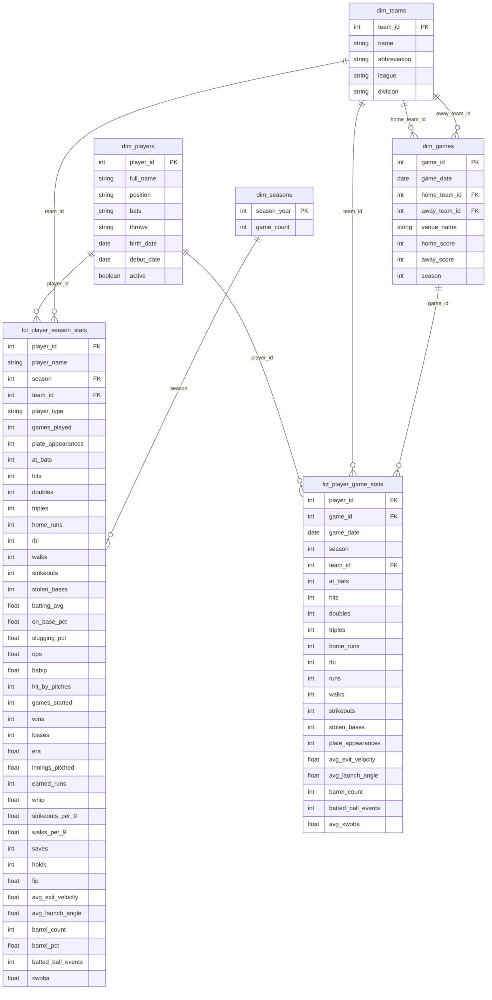
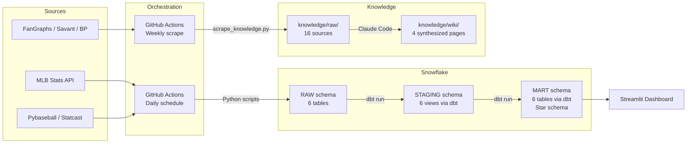

# M02: Present & Polish Implementation Plan

> **For agentic workers:** REQUIRED SUB-SKILL: Use superpowers:subagent-driven-development (recommended) or superpowers:executing-plans to implement this plan task-by-task. Steps use checkbox (`- [ ]`) syntax for tracking.

**Goal:** Build the Streamlit dashboard, knowledge base, ERD, and updated README for M02 — the presentation layer of the baseball analytics pipeline.

**Architecture:** 3-tab Streamlit app connects to Snowflake mart tables via `snowflake-connector-python`, querying the star schema built in M01. Knowledge base uses Firecrawl MCP for initial scraping with a `requests`/`beautifulsoup4` script for GitHub Actions automation. ERD is a Mermaid diagram generated from dbt schema YAML.

**Tech Stack:** Streamlit, Plotly, snowflake-connector-python, pandas, requests, beautifulsoup4, markdownify, GitHub Actions

**Spec:** `docs/superpowers/specs/2026-05-03-m02-present-and-polish-design.md`

---

## File Map

### New Files
| File | Purpose |
|------|---------|
| `dashboard/app.py` | Streamlit dashboard — 3 tabs, Snowflake connection, Plotly charts |
| `dashboard/requirements.txt` | Dashboard Python dependencies |
| `.streamlit/secrets.toml.example` | Template for Snowflake connection (gitignored actual secrets.toml) |
| `extract/scrape_knowledge.py` | Web scraping script for GitHub Actions automation |
| `.github/workflows/scrape_knowledge.yml` | Scheduled web scrape workflow |
| `knowledge/raw/04-fangraphs-woba.md` through `16-savant-statcast-glossary.md` | 13 new scraped sources |
| `knowledge/wiki/overview.md` | Wiki: sabermetrics overview |
| `knowledge/wiki/key-metrics.md` | Wiki: traditional vs. advanced metrics guide |
| `knowledge/wiki/statcast-methodology.md` | Wiki: Statcast data collection and expected stats |
| `knowledge/wiki/player-evaluation-frameworks.md` | Wiki: player evaluation using advanced metrics |
| `knowledge/index.md` | Knowledge base index |

### Modified Files
| File | Change |
|------|--------|
| `.gitignore` | Add `.streamlit/secrets.toml` |
| `README.md` | Full rewrite from template with ERD, pipeline diagram, insights |
| `CLAUDE.md` | Update M02 status |
| `requirements.txt` | Add `requests`, `beautifulsoup4`, `markdownify` |

---

## Task 1: Project Setup

**Files:**
- Modify: `.gitignore`
- Create: `dashboard/requirements.txt`
- Create: `.streamlit/secrets.toml.example`
- Modify: `requirements.txt`

- [ ] **Step 1: Create branch and switch to it**

```bash
git checkout main
git checkout -b feature/m02-present-polish
```

- [ ] **Step 2: Add `.streamlit/secrets.toml` to `.gitignore`**

Append to `.gitignore`:

```
# Streamlit secrets (local development)
.streamlit/secrets.toml
```

- [ ] **Step 3: Create `dashboard/requirements.txt`**

```
streamlit>=1.28
snowflake-connector-python>=3.0
plotly>=5.0
pandas>=2.0
python-dotenv>=1.0
```

- [ ] **Step 4: Create `.streamlit/secrets.toml.example`**

```toml
[snowflake]
account = "your-account-identifier"
user = "your-username"
password = "your-password"
database = "BASEBALL_ANALYTICS"
warehouse = "BASEBALL_WH"
```

- [ ] **Step 5: Add scraping dependencies to `requirements.txt`**

Add these lines to the existing `requirements.txt`:

```
requests>=2.28
beautifulsoup4>=4.12
markdownify>=0.11
```

- [ ] **Step 6: Install new dependencies**

Run: `cd /Users/ajschoolcraft/isba-4715/baseball-ops-analyst-mlb && .venv/bin/pip install -r requirements.txt`

- [ ] **Step 7: Verify directory structure**

Run: `ls dashboard/ .streamlit/`
Expected: `dashboard/requirements.txt` and `.streamlit/secrets.toml.example` exist

- [ ] **Step 8: Commit**

```bash
git add dashboard/requirements.txt .streamlit/secrets.toml.example .gitignore requirements.txt
git commit -m "Add dashboard scaffolding and scraping dependencies for M02"
```

---

## Task 2: Dashboard — Connection Layer + App Skeleton

**Files:**
- Create: `dashboard/app.py`

- [ ] **Step 1: Create `dashboard/app.py` with connection layer, sidebar, and empty tabs**

```python
import os

import pandas as pd
import plotly.express as px
import plotly.graph_objects as go
import snowflake.connector
import streamlit as st

st.set_page_config(
    page_title="MLB Analytics: Traditional vs. Advanced Metrics",
    page_icon="⚾",
    layout="wide",
)


@st.cache_resource
def get_connection():
    try:
        creds = st.secrets["snowflake"]
        return snowflake.connector.connect(
            account=creds["account"],
            user=creds["user"],
            password=creds["password"],
            database=creds["database"],
            warehouse=creds["warehouse"],
        )
    except (FileNotFoundError, KeyError):
        from dotenv import load_dotenv

        load_dotenv()
        return snowflake.connector.connect(
            account=os.environ["SNOWFLAKE_ACCOUNT"],
            user=os.environ["SNOWFLAKE_USER"],
            password=os.environ["SNOWFLAKE_PASSWORD"],
            database=os.environ.get("SNOWFLAKE_DATABASE", "BASEBALL_ANALYTICS"),
            warehouse=os.environ.get("SNOWFLAKE_WAREHOUSE", "BASEBALL_WH"),
        )


@st.cache_data(ttl=3600)
def load_season_batters():
    conn = get_connection()
    return pd.read_sql(
        """
        SELECT
            s.player_id,
            p.full_name,
            t.name AS team_name,
            t.abbreviation AS team_abbr,
            s.season,
            s.plate_appearances,
            s.at_bats,
            s.hits,
            s.batting_avg,
            s.on_base_pct,
            s.slugging_pct,
            s.ops,
            s.babip,
            s.home_runs,
            s.strikeouts,
            s.walks,
            s.xwoba,
            s.barrel_pct,
            s.avg_exit_velocity,
            s.avg_launch_angle,
            s.xwoba - s.batting_avg AS gap_score
        FROM MART.FCT_PLAYER_SEASON_STATS s
        JOIN MART.DIM_PLAYERS p ON s.player_id = p.player_id
        JOIN MART.DIM_TEAMS t ON s.team_id = t.team_id
        WHERE s.player_type = 'batter'
          AND s.xwoba IS NOT NULL
          AND s.plate_appearances > 0
        """,
        conn,
    )


@st.cache_data(ttl=3600)
def load_game_stats(player_id, season):
    conn = get_connection()
    return pd.read_sql(
        """
        SELECT
            g.game_date,
            g.at_bats,
            g.hits,
            g.home_runs,
            g.walks,
            g.strikeouts,
            g.plate_appearances,
            g.avg_xwoba,
            g.barrel_count,
            g.avg_exit_velocity,
            g.batted_ball_events
        FROM MART.FCT_PLAYER_GAME_STATS g
        WHERE g.player_id = %s
          AND g.season = %s
        ORDER BY g.game_date
        """,
        conn,
        params=(int(player_id), int(season)),
    )


# -- Sidebar --
st.sidebar.title("⚾ MLB Analytics")
st.sidebar.caption("Traditional vs. Advanced Metrics")

df_all = load_season_batters()

seasons = sorted(df_all["SEASON"].unique(), reverse=True)
season = st.sidebar.selectbox("Season", seasons)

min_pa = st.sidebar.slider("Minimum Plate Appearances", 0, 500, 100, 25)

teams = sorted(df_all[df_all["SEASON"] == season]["TEAM_NAME"].unique())
selected_teams = st.sidebar.multiselect("Filter by Team", teams, default=teams)

df = df_all[
    (df_all["SEASON"] == season)
    & (df_all["PLATE_APPEARANCES"] >= min_pa)
    & (df_all["TEAM_NAME"].isin(selected_teams))
].copy()

# -- Tabs --
tab1, tab2, tab3 = st.tabs(
    ["📊 League Overview", "🔍 Player Deep Dive", "⚔️ Team Comparison"]
)

with tab1:
    st.info("League Overview — coming next")

with tab2:
    st.info("Player Deep Dive — coming next")

with tab3:
    st.info("Team Comparison — coming next")
```

- [ ] **Step 2: Verify the app loads locally**

Run: `cd /Users/ajschoolcraft/isba-4715/baseball-ops-analyst-mlb && .venv/bin/streamlit run dashboard/app.py`

Expected: App opens in browser with sidebar filters and 3 empty tabs. Data loads from Snowflake (uses `.env` fallback).

- [ ] **Step 3: Commit**

```bash
git add dashboard/app.py
git commit -m "Add Streamlit dashboard skeleton with Snowflake connection and sidebar filters"
```

---

## Task 3: Dashboard — Tab 1: League Overview (Descriptive)

**Files:**
- Modify: `dashboard/app.py` (replace Tab 1 placeholder)

- [ ] **Step 1: Replace the Tab 1 placeholder with League Overview content**

Replace the `with tab1:` block in `dashboard/app.py` with:

```python
with tab1:
    st.header("Where Traditional Stats and Advanced Metrics Disagree")

    col1, col2, col3, col4 = st.columns(4)
    col1.metric("League Avg BA", f"{df['BATTING_AVG'].mean():.3f}")
    col2.metric("League Avg xwOBA", f"{df['XWOBA'].mean():.3f}")
    col3.metric("Avg Barrel %", f"{df['BARREL_PCT'].mean():.1f}%")
    col4.metric("Avg Exit Velo", f"{df['AVG_EXIT_VELOCITY'].mean():.1f} mph")

    st.markdown("---")

    fig_scatter = px.scatter(
        df,
        x="BATTING_AVG",
        y="XWOBA",
        color="GAP_SCORE",
        color_continuous_scale="RdYlGn",
        size="PLATE_APPEARANCES",
        hover_name="FULL_NAME",
        hover_data={
            "TEAM_ABBR": True,
            "PLATE_APPEARANCES": True,
            "BARREL_PCT": ":.1f",
            "GAP_SCORE": ":.3f",
            "BATTING_AVG": ":.3f",
            "XWOBA": ":.3f",
        },
        title="Batting Average vs. xwOBA — Green Dots Signal Undervalued Hitters",
        labels={
            "BATTING_AVG": "Batting Average",
            "XWOBA": "xwOBA (Expected Weighted On-Base Average)",
            "GAP_SCORE": "Gap Score",
            "PLATE_APPEARANCES": "PA",
            "TEAM_ABBR": "Team",
            "BARREL_PCT": "Barrel %",
        },
    )
    fig_scatter.update_layout(height=500)
    st.plotly_chart(fig_scatter, use_container_width=True)

    st.subheader("Most Undervalued: Batted-Ball Quality Exceeds Traditional Results")

    top_undervalued = df.nlargest(10, "GAP_SCORE")[
        [
            "FULL_NAME",
            "TEAM_ABBR",
            "BATTING_AVG",
            "XWOBA",
            "GAP_SCORE",
            "BARREL_PCT",
            "AVG_EXIT_VELOCITY",
        ]
    ].reset_index(drop=True)

    fig_bar = px.bar(
        top_undervalued,
        x="FULL_NAME",
        y="GAP_SCORE",
        color="GAP_SCORE",
        color_continuous_scale="Greens",
        title="Top 10 Undervalued Batters by xwOBA − Batting Average Gap",
        labels={"FULL_NAME": "Player", "GAP_SCORE": "Gap Score (xwOBA − BA)"},
        hover_data={
            "BATTING_AVG": ":.3f",
            "XWOBA": ":.3f",
            "BARREL_PCT": ":.1f",
            "TEAM_ABBR": True,
        },
    )
    fig_bar.update_layout(height=400, showlegend=False)
    st.plotly_chart(fig_bar, use_container_width=True)
```

- [ ] **Step 2: Verify Tab 1 renders correctly**

Run: `cd /Users/ajschoolcraft/isba-4715/baseball-ops-analyst-mlb && .venv/bin/streamlit run dashboard/app.py`

Expected: Tab 1 shows 4 metric cards, a scatter plot colored by gap score, and a top-10 bar chart. Hover shows player details. Sidebar filters affect the data.

- [ ] **Step 3: Commit**

```bash
git add dashboard/app.py
git commit -m "Add League Overview tab with scatter plot and undervalued batters chart"
```

---

## Task 4: Dashboard — Tab 2: Player Deep Dive (Diagnostic)

**Files:**
- Modify: `dashboard/app.py` (replace Tab 2 placeholder)

- [ ] **Step 1: Replace the Tab 2 placeholder with Player Deep Dive content**

Replace the `with tab2:` block in `dashboard/app.py` with:

```python
with tab2:
    st.header("Why Is This Player Over- or Underperforming?")

    player_options = (
        df.sort_values("FULL_NAME")[["PLAYER_ID", "FULL_NAME", "TEAM_ABBR"]]
        .drop_duplicates()
        .reset_index(drop=True)
    )

    if player_options.empty:
        st.warning("No players match the current filters.")
    else:
        player_display = player_options.apply(
            lambda r: f"{r['FULL_NAME']} ({r['TEAM_ABBR']})", axis=1
        )
        selected_idx = st.selectbox(
            "Select a Player",
            player_options.index,
            format_func=lambda i: player_display[i],
        )
        player_id = int(player_options.loc[selected_idx, "PLAYER_ID"])
        player_name = player_options.loc[selected_idx, "FULL_NAME"]

        player_season = df[df["PLAYER_ID"] == player_id].iloc[0]

        st.subheader(f"{player_name} — Season Summary")
        col1, col2, col3, col4 = st.columns(4)
        col1.metric("Batting AVG", f"{player_season['BATTING_AVG']:.3f}")
        col2.metric(
            "OBP / SLG / OPS",
            f"{player_season['ON_BASE_PCT']:.3f} / "
            f"{player_season['SLUGGING_PCT']:.3f} / "
            f"{player_season['OPS']:.3f}",
        )
        col3.metric(
            "xwOBA",
            f"{player_season['XWOBA']:.3f}",
            delta=f"{player_season['GAP_SCORE']:.3f} vs BA",
        )
        col4.metric("Barrel %", f"{player_season['BARREL_PCT']:.1f}%")

        col5, col6, col7, col8 = st.columns(4)
        col5.metric(
            "Avg Exit Velo", f"{player_season['AVG_EXIT_VELOCITY']:.1f} mph"
        )
        col6.metric("Home Runs", f"{int(player_season['HOME_RUNS'])}")
        col7.metric("BABIP", f"{player_season['BABIP']:.3f}")
        col8.metric("Plate Appearances", f"{int(player_season['PLATE_APPEARANCES'])}")

        st.markdown("---")

        game_df = load_game_stats(player_id, season)

        if len(game_df) >= 5:
            game_df = game_df.sort_values("GAME_DATE").reset_index(drop=True)

            game_df["ROLLING_BA"] = game_df["HITS"].rolling(
                15, min_periods=5
            ).sum() / game_df["AT_BATS"].rolling(15, min_periods=5).sum()

            game_df["ROLLING_XWOBA"] = (
                game_df["AVG_XWOBA"].rolling(15, min_periods=5).mean()
            )

            fig_trend = go.Figure()
            fig_trend.add_trace(
                go.Scatter(
                    x=game_df["GAME_DATE"],
                    y=game_df["ROLLING_BA"],
                    mode="lines",
                    name="Rolling BA (15-game)",
                    line=dict(color="#EF553B", width=2),
                )
            )
            fig_trend.add_trace(
                go.Scatter(
                    x=game_df["GAME_DATE"],
                    y=game_df["ROLLING_XWOBA"],
                    mode="lines",
                    name="Rolling xwOBA (15-game)",
                    line=dict(color="#636EFA", width=2),
                )
            )
            fig_trend.update_layout(
                title=f"{player_name}: When the Gap Between Results and Quality Developed",
                xaxis_title="Date",
                yaxis_title="Value",
                height=400,
                legend=dict(yanchor="top", y=0.99, xanchor="left", x=0.01),
            )
            st.plotly_chart(fig_trend, use_container_width=True)

            bbe_rolling = (
                game_df["BATTED_BALL_EVENTS"]
                .replace(0, pd.NA)
                .rolling(15, min_periods=5)
                .sum()
            )
            game_df["ROLLING_BARREL_PCT"] = (
                game_df["BARREL_COUNT"].rolling(15, min_periods=5).sum()
                / bbe_rolling
                * 100
            )
            game_df["ROLLING_EXIT_VELO"] = (
                game_df["AVG_EXIT_VELOCITY"].rolling(15, min_periods=5).mean()
            )

            fig_quality = go.Figure()
            fig_quality.add_trace(
                go.Scatter(
                    x=game_df["GAME_DATE"],
                    y=game_df["ROLLING_EXIT_VELO"],
                    mode="lines",
                    name="Avg Exit Velocity (mph)",
                    line=dict(color="#00CC96", width=2),
                )
            )
            fig_quality.add_trace(
                go.Scatter(
                    x=game_df["GAME_DATE"],
                    y=game_df["ROLLING_BARREL_PCT"],
                    mode="lines",
                    name="Barrel %",
                    line=dict(color="#AB63FA", width=2),
                    yaxis="y2",
                )
            )
            fig_quality.update_layout(
                title=f"{player_name}: Contact Quality Explains the Gap",
                xaxis_title="Date",
                yaxis=dict(title="Exit Velocity (mph)"),
                yaxis2=dict(title="Barrel %", overlaying="y", side="right"),
                height=400,
                legend=dict(yanchor="top", y=0.99, xanchor="left", x=0.01),
            )
            st.plotly_chart(fig_quality, use_container_width=True)
        else:
            st.info(
                "Not enough game data for trend charts (need at least 5 games)."
            )
```

- [ ] **Step 2: Verify Tab 2 renders correctly**

Run: `cd /Users/ajschoolcraft/isba-4715/baseball-ops-analyst-mlb && .venv/bin/streamlit run dashboard/app.py`

Expected: Tab 2 shows a player selector, 8 metric cards for the selected player, a rolling BA vs. xwOBA trend line, and a contact quality chart with dual y-axes. Changing the player updates all charts.

- [ ] **Step 3: Commit**

```bash
git add dashboard/app.py
git commit -m "Add Player Deep Dive tab with trend analysis and contact quality charts"
```

---

## Task 5: Dashboard — Tab 3: Team Comparison

**Files:**
- Modify: `dashboard/app.py` (replace Tab 3 placeholder)

- [ ] **Step 1: Replace the Tab 3 placeholder with Team Comparison content**

Replace the `with tab3:` block in `dashboard/app.py` with:

```python
with tab3:
    st.header("Team Roster Profile: Real Quality or Lucky Results?")

    team_list = sorted(df["TEAM_NAME"].unique())

    if not team_list:
        st.warning("No teams match the current filters.")
    else:
        default_team = (
            team_list.index("San Francisco Giants")
            if "San Francisco Giants" in team_list
            else 0
        )
        col_t1, col_t2 = st.columns(2)
        team1 = col_t1.selectbox("Primary Team", team_list, index=default_team)
        compare = col_t2.checkbox("Compare with another team")

        team_df = df[df["TEAM_NAME"] == team1].sort_values(
            "GAP_SCORE", ascending=False
        )
        league_avg_ba = df["BATTING_AVG"].mean()
        league_avg_xwoba = df["XWOBA"].mean()
        team_avg_ba = team_df["BATTING_AVG"].mean()
        team_avg_xwoba = team_df["XWOBA"].mean()
        team_avg_barrel = team_df["BARREL_PCT"].mean()
        team_avg_ev = team_df["AVG_EXIT_VELOCITY"].mean()

        st.subheader(f"{team1} — Aggregate vs. League")
        tc1, tc2, tc3, tc4 = st.columns(4)
        tc1.metric(
            "Team Avg BA",
            f"{team_avg_ba:.3f}",
            delta=f"{team_avg_ba - league_avg_ba:+.3f} vs league",
        )
        tc2.metric(
            "Team Avg xwOBA",
            f"{team_avg_xwoba:.3f}",
            delta=f"{team_avg_xwoba - league_avg_xwoba:+.3f} vs league",
        )
        tc3.metric("Team Avg Barrel %", f"{team_avg_barrel:.1f}%")
        tc4.metric("Team Avg Exit Velo", f"{team_avg_ev:.1f} mph")

        st.subheader("Roster Breakdown")
        display_cols = {
            "FULL_NAME": "Player",
            "BATTING_AVG": "AVG",
            "ON_BASE_PCT": "OBP",
            "SLUGGING_PCT": "SLG",
            "OPS": "OPS",
            "XWOBA": "xwOBA",
            "BARREL_PCT": "Barrel%",
            "AVG_EXIT_VELOCITY": "Exit Velo",
            "GAP_SCORE": "Gap Score",
            "PLATE_APPEARANCES": "PA",
        }
        roster_display = team_df[list(display_cols.keys())].rename(
            columns=display_cols
        )

        st.dataframe(
            roster_display.style.format(
                {
                    "AVG": "{:.3f}",
                    "OBP": "{:.3f}",
                    "SLG": "{:.3f}",
                    "OPS": "{:.3f}",
                    "xwOBA": "{:.3f}",
                    "Barrel%": "{:.1f}",
                    "Exit Velo": "{:.1f}",
                    "Gap Score": "{:+.3f}",
                    "PA": "{:.0f}",
                }
            ).background_gradient(subset=["Gap Score"], cmap="RdYlGn"),
            use_container_width=True,
            hide_index=True,
        )

        if compare:
            other_teams = [t for t in team_list if t != team1]
            if other_teams:
                team2 = st.selectbox("Compare With", other_teams)
                team2_df = df[df["TEAM_NAME"] == team2]
                t2_ba = team2_df["BATTING_AVG"].mean()
                t2_xwoba = team2_df["XWOBA"].mean()
                t2_barrel = team2_df["BARREL_PCT"].mean()
                t2_ev = team2_df["AVG_EXIT_VELOCITY"].mean()

                st.subheader(f"{team2} — Head to Head")
                hc1, hc2, hc3, hc4 = st.columns(4)
                hc1.metric(
                    "Avg BA",
                    f"{t2_ba:.3f}",
                    delta=f"{t2_ba - team_avg_ba:+.3f} vs {team1}",
                )
                hc2.metric(
                    "Avg xwOBA",
                    f"{t2_xwoba:.3f}",
                    delta=f"{t2_xwoba - team_avg_xwoba:+.3f} vs {team1}",
                )
                hc3.metric(
                    "Avg Barrel%",
                    f"{t2_barrel:.1f}%",
                    delta=f"{t2_barrel - team_avg_barrel:+.1f} vs {team1}",
                )
                hc4.metric(
                    "Avg Exit Velo",
                    f"{t2_ev:.1f} mph",
                    delta=f"{t2_ev - team_avg_ev:+.1f} vs {team1}",
                )
```

- [ ] **Step 2: Verify Tab 3 renders correctly**

Run: `cd /Users/ajschoolcraft/isba-4715/baseball-ops-analyst-mlb && .venv/bin/streamlit run dashboard/app.py`

Expected: Tab 3 shows team selector (default SF Giants), 4 aggregate metric cards with league comparison deltas, a sortable roster table with gap-score gradient, and optional head-to-head comparison.

- [ ] **Step 3: Commit**

```bash
git add dashboard/app.py
git commit -m "Add Team Comparison tab with roster table and head-to-head metrics"
```

---

## Task 6: Dashboard — Local Verification and Polish

**Files:**
- Modify: `dashboard/app.py` (minor adjustments only)

- [ ] **Step 1: Run the full dashboard and verify all three tabs**

Run: `cd /Users/ajschoolcraft/isba-4715/baseball-ops-analyst-mlb && .venv/bin/streamlit run dashboard/app.py`

Verify:
- Sidebar: season selector, PA slider, and team filter all work
- Tab 1: scatter plot renders with color scale, bar chart shows top 10, metric cards display numbers
- Tab 2: player selector populates, metric cards update, trend charts render for players with game data
- Tab 3: team selector defaults to Giants, roster table is sortable, comparison mode works
- No Python errors in terminal

- [ ] **Step 2: Fix any rendering issues found in Step 1**

Common fixes to check:
- If `BARREL_PCT` or `AVG_EXIT_VELOCITY` has NaN values, ensure `.mean()` calls use `skipna=True` (default)
- If `GAME_DATE` is a string, cast it: `game_df["GAME_DATE"] = pd.to_datetime(game_df["GAME_DATE"])`
- If the team multiselect defaults cause a blank display, verify the filter logic

- [ ] **Step 3: Commit any fixes**

```bash
git add dashboard/app.py
git commit -m "Fix dashboard rendering issues found during local testing"
```

Skip this commit if no fixes were needed.

---

## Task 7: Knowledge Base — Scrape Raw Sources

**Files:**
- Create: `knowledge/raw/04-fangraphs-woba.md` through `knowledge/raw/16-savant-statcast-glossary.md`

This task scrapes 13 new sources using Firecrawl MCP (if available) or `curl` + manual conversion. Sources are committed in 3 batches to show iterative development in the commit history.

### Batch 1: FanGraphs Core Metrics (sources 04-07)

- [ ] **Step 1: Scrape source 04 — FanGraphs wOBA**

URL: `https://library.fangraphs.com/offense/woba/`

Use Firecrawl MCP `firecrawl_scrape` tool with `formats: ["markdown"]`. Save output to `knowledge/raw/04-fangraphs-woba.md`. Prepend the file with:

```
Source: https://library.fangraphs.com/offense/woba/
```

- [ ] **Step 2: Scrape source 05 — FanGraphs FIP**

URL: `https://library.fangraphs.com/pitching/fip/`

Save to `knowledge/raw/05-fangraphs-fip.md` with `Source:` header.

- [ ] **Step 3: Scrape source 06 — FanGraphs BABIP**

URL: `https://library.fangraphs.com/pitching/babip/`

Save to `knowledge/raw/06-fangraphs-babip.md` with `Source:` header.

- [ ] **Step 4: Scrape source 07 — FanGraphs WAR**

URL: `https://library.fangraphs.com/misc/war/`

Save to `knowledge/raw/07-fangraphs-war.md` with `Source:` header.

- [ ] **Step 5: Commit batch 1**

```bash
git add knowledge/raw/04-fangraphs-woba.md knowledge/raw/05-fangraphs-fip.md knowledge/raw/06-fangraphs-babip.md knowledge/raw/07-fangraphs-war.md
git commit -m "Add FanGraphs core metric sources to knowledge base (wOBA, FIP, BABIP, WAR)"
```

### Batch 2: Baseball Savant Methodology (sources 08-11)

- [ ] **Step 6: Scrape source 08 — Savant Expected Stats**

URL: `https://baseballsavant.mlb.com/leaderboard/expected_statistics`

Save to `knowledge/raw/08-savant-expected-stats.md` with `Source:` header. Focus on the methodology text, not the leaderboard data.

- [ ] **Step 7: Scrape source 09 — Savant Barrel Definition**

URL: `https://baseballsavant.mlb.com/leaderboard/statcast?type=batter&year=2025&position=&team=&min=q`

For barrel-specific content, also check: `https://www.mlb.com/glossary/statcast/barrel`

Save to `knowledge/raw/09-savant-barrel-definition.md` with `Source:` header.

- [ ] **Step 8: Scrape source 10 — Savant Exit Velocity & Launch Angle**

URL: `https://www.mlb.com/glossary/statcast/exit-velocity`

Also include launch angle: `https://www.mlb.com/glossary/statcast/launch-angle`

Save to `knowledge/raw/10-savant-exit-velo-launch-angle.md` with `Source:` header. Combine both into one file.

- [ ] **Step 9: Scrape source 11 — Savant Pitch Tracking**

URL: `https://www.mlb.com/glossary/statcast`

Save to `knowledge/raw/11-savant-pitch-tracking.md` with `Source:` header. Focus on the Statcast system overview and pitch tracking methodology.

- [ ] **Step 10: Commit batch 2**

```bash
git add knowledge/raw/08-savant-expected-stats.md knowledge/raw/09-savant-barrel-definition.md knowledge/raw/10-savant-exit-velo-launch-angle.md knowledge/raw/11-savant-pitch-tracking.md
git commit -m "Add Baseball Savant methodology sources to knowledge base"
```

### Batch 3: Remaining Sources (sources 12-16)

- [ ] **Step 11: Scrape source 12 — FanGraphs OPS+**

URL: `https://library.fangraphs.com/offense/ops/`

Save to `knowledge/raw/12-fangraphs-ops-plus.md` with `Source:` header.

- [ ] **Step 12: Scrape source 13 — Baseball Prospectus Intro to Sabermetrics**

URL: `https://www.baseballprospectus.com/glossary/`

Save to `knowledge/raw/13-bp-intro-sabermetrics.md` with `Source:` header.

- [ ] **Step 13: Scrape source 14 — Baseball Prospectus DRC+**

URL: `https://www.baseballprospectus.com/glossary/index.php?search=DRC`

Save to `knowledge/raw/14-bp-drc-plus.md` with `Source:` header.

- [ ] **Step 14: Scrape source 15 — Tangotiger Linear Weights**

URL: `http://www.intothebook.com/linear-weights/`

Fallback: `https://library.fangraphs.com/principles/linear-weights/`

Save to `knowledge/raw/15-tangotiger-linear-weights.md` with `Source:` header.

- [ ] **Step 15: Scrape source 16 — Savant Statcast Glossary**

URL: `https://baseballsavant.mlb.com/statcast-metrics-context`

Note: Source 01 already covers part of this page. This scrape should capture the full glossary including all metric definitions not in source 01.

Save to `knowledge/raw/16-savant-statcast-glossary.md` with `Source:` header.

- [ ] **Step 16: Commit batch 3**

```bash
git add knowledge/raw/12-fangraphs-ops-plus.md knowledge/raw/13-bp-intro-sabermetrics.md knowledge/raw/14-bp-drc-plus.md knowledge/raw/15-tangotiger-linear-weights.md knowledge/raw/16-savant-statcast-glossary.md
git commit -m "Add remaining knowledge base sources (OPS+, BP glossary, DRC+, linear weights, Statcast glossary)"
```

---

## Task 8: Web Scrape Automation — Script + GitHub Actions

**Files:**
- Create: `extract/scrape_knowledge.py`
- Create: `.github/workflows/scrape_knowledge.yml`

- [ ] **Step 1: Create `extract/scrape_knowledge.py`**

```python
"""Scrape knowledge base sources and save as markdown files.

Reads URLs from a config list, scrapes each with requests + beautifulsoup4,
converts to markdown, and saves to knowledge/raw/. Used by GitHub Actions
for scheduled re-scraping.
"""

import sys
from pathlib import Path

import requests
from bs4 import BeautifulSoup
from markdownify import markdownify as md

SOURCES = [
    ("01-statcast-metrics-context.md", "https://baseballsavant.mlb.com/statcast-metrics-context"),
    ("02-fangraphs-wrc-plus.md", "https://library.fangraphs.com/offense/wrc/"),
    ("03-driveline-stuff-plus-pitch-models.md", "https://www.drivelinebaseball.com/2021/12/what-is-stuff-quantifying-pitches-with-pitch-models/"),
    ("04-fangraphs-woba.md", "https://library.fangraphs.com/offense/woba/"),
    ("05-fangraphs-fip.md", "https://library.fangraphs.com/pitching/fip/"),
    ("06-fangraphs-babip.md", "https://library.fangraphs.com/pitching/babip/"),
    ("07-fangraphs-war.md", "https://library.fangraphs.com/misc/war/"),
    ("08-savant-expected-stats.md", "https://baseballsavant.mlb.com/leaderboard/expected_statistics"),
    ("09-savant-barrel-definition.md", "https://www.mlb.com/glossary/statcast/barrel"),
    ("10-savant-exit-velo-launch-angle.md", "https://www.mlb.com/glossary/statcast/exit-velocity"),
    ("11-savant-pitch-tracking.md", "https://www.mlb.com/glossary/statcast"),
    ("12-fangraphs-ops-plus.md", "https://library.fangraphs.com/offense/ops/"),
    ("13-bp-intro-sabermetrics.md", "https://www.baseballprospectus.com/glossary/"),
    ("14-bp-drc-plus.md", "https://www.baseballprospectus.com/glossary/index.php?search=DRC"),
    ("15-tangotiger-linear-weights.md", "https://library.fangraphs.com/principles/linear-weights/"),
    ("16-savant-statcast-glossary.md", "https://baseballsavant.mlb.com/statcast-metrics-context"),
]

HEADERS = {
    "User-Agent": "Mozilla/5.0 (compatible; BaseballAnalyticsBot/1.0; +https://github.com/ajschoolcraft/baseball-ops-analyst-mlb)"
}

RAW_DIR = Path(__file__).resolve().parent.parent / "knowledge" / "raw"


def scrape_source(filename: str, url: str) -> bool:
    try:
        resp = requests.get(url, headers=HEADERS, timeout=30)
        resp.raise_for_status()
    except requests.RequestException as e:
        print(f"SKIP {filename}: {e}")
        return False

    soup = BeautifulSoup(resp.text, "html.parser")

    for tag in soup(["script", "style", "nav", "footer", "header"]):
        tag.decompose()

    main = soup.find("main") or soup.find("article") or soup.find("body")
    content = md(str(main), heading_style="ATX", strip=["img"])

    RAW_DIR.mkdir(parents=True, exist_ok=True)
    out = RAW_DIR / filename
    out.write_text(f"Source: {url}\n\n{content.strip()}\n")
    print(f"OK   {filename} ({len(content)} chars)")
    return True


def main():
    ok, skip = 0, 0
    for filename, url in SOURCES:
        if scrape_source(filename, url):
            ok += 1
        else:
            skip += 1
    print(f"\nDone: {ok} scraped, {skip} skipped")
    if skip > 0:
        sys.exit(1)


if __name__ == "__main__":
    main()
```

- [ ] **Step 2: Create `.github/workflows/scrape_knowledge.yml`**

```yaml
name: Scrape Knowledge Base Sources

on:
  schedule:
    - cron: '0 12 * * 1'  # Weekly on Monday at 12 PM UTC
  workflow_dispatch:

jobs:
  scrape:
    runs-on: ubuntu-latest
    steps:
      - name: Checkout repo
        uses: actions/checkout@v4

      - name: Set up Python 3.11
        uses: actions/setup-python@v5
        with:
          python-version: '3.11'

      - name: Install dependencies
        run: pip install requests beautifulsoup4 markdownify

      - name: Run scraper
        run: python -m extract.scrape_knowledge

      - name: Commit updated sources
        run: |
          git config user.name "github-actions[bot]"
          git config user.email "github-actions[bot]@users.noreply.github.com"
          git add knowledge/raw/
          if git diff --staged --quiet; then
            echo "No changes to commit"
          else
            git commit -m "chore: update knowledge base sources [automated]"
            git push
          fi
```

- [ ] **Step 3: Verify the scraping script runs locally**

Run: `cd /Users/ajschoolcraft/isba-4715/baseball-ops-analyst-mlb && .venv/bin/python -m extract.scrape_knowledge`

Expected: Prints `OK` or `SKIP` for each source. Most should succeed. Some sites may block automated requests — that's acceptable since the initial scrape was done via Firecrawl.

- [ ] **Step 4: Commit**

```bash
git add extract/scrape_knowledge.py .github/workflows/scrape_knowledge.yml
git commit -m "Add knowledge base scraping script and GitHub Actions workflow"
```

---

## Task 9: Knowledge Base — Wiki Pages + Index

**Files:**
- Create: `knowledge/wiki/overview.md`
- Create: `knowledge/wiki/key-metrics.md`
- Create: `knowledge/wiki/statcast-methodology.md`
- Create: `knowledge/wiki/player-evaluation-frameworks.md`
- Create: `knowledge/index.md`

- [ ] **Step 1: Read all raw sources to build synthesis context**

Read every file in `knowledge/raw/` to understand the full content available for wiki synthesis.

- [ ] **Step 2: Create `knowledge/wiki/overview.md`**

Synthesize across all raw sources to create an overview of sabermetrics and why advanced metrics matter. Include:
- Brief history (Bill James → modern analytics)
- Why traditional stats (AVG, ERA, RBI) can be misleading
- What the Statcast revolution changed
- How this knowledge base is organized
- Citation format: `(see [source-filename])` for claims drawn from specific sources

- [ ] **Step 3: Create `knowledge/wiki/key-metrics.md`**

Comprehensive guide covering every metric in the pipeline's star schema. For each metric:
- What it measures
- Scale/benchmarks (e.g., league-average wRC+ is 100)
- When to use it vs. alternatives
- Traditional counterpart (if applicable)

Organize as: **Traditional Hitting** (AVG, OBP, SLG, OPS, BABIP) → **Advanced Hitting** (wOBA, wRC+, xwOBA) → **Batted Ball** (barrel%, exit velo, launch angle) → **Pitching Traditional** (ERA, WHIP, K/9) → **Pitching Advanced** (FIP, Stuff+, xFIP) → **Holistic** (WAR, DRC+).

Cite source files for definitions and formulas.

- [ ] **Step 4: Create `knowledge/wiki/statcast-methodology.md`**

Synthesize from Savant and Driveline sources:
- What is Statcast (hardware: Hawk-Eye, Doppler)
- What it tracks (pitch velocity, spin rate, exit velocity, launch angle, sprint speed)
- How expected stats (xwOBA, xBA, xSLG) are calculated
- Barrel classification (exit velocity ≥ 98 mph, launch angle 26-30°, expanding range)
- Data availability (2015-present for most metrics, 2020+ for Hawk-Eye)

Cite source files.

- [ ] **Step 5: Create `knowledge/wiki/player-evaluation-frameworks.md`**

Synthesize a practical guide for evaluating players:
- Traditional scouting + analytics integration
- When traditional vs. advanced stats diverge: what causes gaps (BABIP luck, shift effects, ballpark factors)
- The "gap score" concept: xwOBA − batting AVG as a diagnostic signal
- Red flags in traditional stats (high BABIP + low barrel% = regression candidate)
- Case study template: how to evaluate a player using the metrics in this pipeline

Cite source files.

- [ ] **Step 6: Create `knowledge/index.md`**

```markdown
# Knowledge Base Index

## Wiki Pages

- **[Overview](wiki/overview.md)** — What is sabermetrics, why advanced metrics matter, and how this knowledge base is organized.
- **[Key Metrics Guide](wiki/key-metrics.md)** — Comprehensive guide to every metric in the pipeline: traditional vs. advanced, with scales and benchmarks.
- **[Statcast Methodology](wiki/statcast-methodology.md)** — How Statcast collects data, expected stats methodology, and barrel classification.
- **[Player Evaluation Frameworks](wiki/player-evaluation-frameworks.md)** — How to evaluate players when traditional and advanced metrics disagree.

## Raw Sources

| # | File | Site | Topic |
|---|------|------|-------|
| 01 | [01-statcast-metrics-context.md](raw/01-statcast-metrics-context.md) | Baseball Savant | Metric definitions, outcomes by contact quality |
| 02 | [02-fangraphs-wrc-plus.md](raw/02-fangraphs-wrc-plus.md) | FanGraphs | Weighted Runs Created (wRC+) |
| 03 | [03-driveline-stuff-plus-pitch-models.md](raw/03-driveline-stuff-plus-pitch-models.md) | Driveline | Stuff+ pitch quality model |
| 04 | [04-fangraphs-woba.md](raw/04-fangraphs-woba.md) | FanGraphs | Weighted On-Base Average (wOBA) |
| 05 | [05-fangraphs-fip.md](raw/05-fangraphs-fip.md) | FanGraphs | Fielding Independent Pitching (FIP) |
| 06 | [06-fangraphs-babip.md](raw/06-fangraphs-babip.md) | FanGraphs | BABIP methodology |
| 07 | [07-fangraphs-war.md](raw/07-fangraphs-war.md) | FanGraphs | Wins Above Replacement (WAR) |
| 08 | [08-savant-expected-stats.md](raw/08-savant-expected-stats.md) | Baseball Savant | xwOBA, xBA, xSLG methodology |
| 09 | [09-savant-barrel-definition.md](raw/09-savant-barrel-definition.md) | Baseball Savant | Barrel classification |
| 10 | [10-savant-exit-velo-launch-angle.md](raw/10-savant-exit-velo-launch-angle.md) | Baseball Savant | Exit velocity and launch angle |
| 11 | [11-savant-pitch-tracking.md](raw/11-savant-pitch-tracking.md) | Baseball Savant | Statcast system overview |
| 12 | [12-fangraphs-ops-plus.md](raw/12-fangraphs-ops-plus.md) | FanGraphs | OPS and OPS+ |
| 13 | [13-bp-intro-sabermetrics.md](raw/13-bp-intro-sabermetrics.md) | Baseball Prospectus | Analytical framework overview |
| 14 | [14-bp-drc-plus.md](raw/14-bp-drc-plus.md) | Baseball Prospectus | Deserved Runs Created Plus (DRC+) |
| 15 | [15-tangotiger-linear-weights.md](raw/15-tangotiger-linear-weights.md) | FanGraphs / Tangotiger | Linear weights and run expectancy |
| 16 | [16-savant-statcast-glossary.md](raw/16-savant-statcast-glossary.md) | Baseball Savant | Full Statcast metric glossary |
```

- [ ] **Step 7: Commit wiki pages and index**

```bash
git add knowledge/wiki/ knowledge/index.md
git commit -m "Add knowledge base wiki pages and index — synthesized from 16 raw sources"
```

---

## Task 10: ERD + README

**Files:**
- Modify: `README.md`

- [ ] **Step 1: Generate the ERD Mermaid diagram**

Build the ERD from the dbt schema YAML (`dbt/models/mart/_mart_schema.yml`) and the mart model SQL files. The ERD must include all columns from each mart model.

The ERD Mermaid block:

````markdown

````

- [ ] **Step 2: Rewrite `README.md` using the template**

Full README content (update the `[STREAMLIT_URL]` placeholder after deployment in Task 11):

````markdown
# Baseball Operations Analyst — MLB Player Performance Analytics

An end-to-end analytics engineering pipeline that extracts MLB player performance data from public APIs, loads it into Snowflake, transforms it through dbt into a star schema, and surfaces insights through a Streamlit dashboard — comparing traditional batting stats to Statcast advanced metrics to identify undervalued and overvalued players across the league.

Built as a portfolio project for ISBA 4715 (capstone), targeting a Baseball Operations Analyst role.

## Job Posting

- **Role:** Baseball Operations Analyst
- **Company:** San Francisco Giants
- **Link:** [Indeed posting](https://www.indeed.com/viewjob?jk=3e00112638e61b02)

This project demonstrates SQL proficiency, Python-based data extraction, statistical analysis on real MLB datasets, and the ability to prototype interactive visualizations — all core requirements from the posting.

## Tech Stack

| Layer | Tool |
|---|---|
| Source 1 (API) | MLB Stats API (`statsapi.mlb.com`) + Pybaseball (Statcast) |
| Source 2 (Web scrape) | Firecrawl + requests/BeautifulSoup (FanGraphs, Baseball Savant, BP) |
| Data Warehouse | Snowflake |
| Transformation | dbt (staging + mart layers) |
| Orchestration | GitHub Actions |
| Dashboard | Streamlit |
| Knowledge Base | Claude Code (scrape → synthesize → query) |

## Pipeline Diagram



## ERD (Star Schema)


## Dashboard Preview

<!-- TODO: Replace with actual screenshot after deployment -->

## Key Insights

**Descriptive (what happened?):** [To be filled after dashboard is live with real data]

**Diagnostic (why did it happen?):** [To be filled after dashboard is live with real data]

**Recommendation:** [Action] → [Expected outcome — to be filled after analysis]

## Live Dashboard

**URL:** [STREAMLIT_URL]

## Knowledge Base

A Claude Code-curated wiki built from 16 scraped sources across FanGraphs, Baseball Savant, Baseball Prospectus, Driveline, and Tangotiger. Wiki pages live in `knowledge/wiki/`, raw sources in `knowledge/raw/`. Browse `knowledge/index.md` to see all pages.

**Query it:** Open Claude Code in this repo and ask questions like:

- "What does the knowledge base say about how xwOBA is calculated?"
- "How does barrel classification work according to Statcast?"
- "When should I trust wRC+ over batting average for player evaluation?"

Claude Code reads the wiki pages first and falls back to raw sources when needed. See `CLAUDE.md` for the query conventions.

## Setup & Reproduction

**Prerequisites:** Python 3.11+, Snowflake trial account (AWS US East 1), dbt

1. Clone the repo and create a virtual environment
   ```bash
   git clone https://github.com/ajschoolcraft/baseball-ops-analyst-mlb.git
   cd baseball-ops-analyst-mlb
   python -m venv .venv && source .venv/bin/activate
   ```
2. Install dependencies
   ```bash
   pip install -r requirements.txt
   ```
3. Copy `.env.example` to `.env` and fill in Snowflake credentials
   ```
   SNOWFLAKE_ACCOUNT=
   SNOWFLAKE_USER=
   SNOWFLAKE_PASSWORD=
   SNOWFLAKE_DATABASE=BASEBALL_ANALYTICS
   SNOWFLAKE_WAREHOUSE=BASEBALL_WH
   ```
4. Run `extract/setup_snowflake.sql` in Snowflake to create database objects
5. Run extraction scripts
   ```bash
   python -m extract.teams
   python -m extract.players 2024,2025
   python -m extract.games 2024,2025
   python -m extract.season_stats 2024,2025
   python -m extract.game_logs 2024,2025
   python -m extract.statcast 2024,2025
   ```
6. Set up `~/.dbt/profiles.yml` for the `baseball_analytics` profile
7. Run dbt
   ```bash
   cd dbt && dbt deps && dbt run && dbt test
   ```
8. Run the dashboard locally
   ```bash
   streamlit run dashboard/app.py
   ```

## Repository Structure

```
.
├── .github/workflows/       # GitHub Actions (daily ELT + weekly scrape)
├── .streamlit/              # Streamlit config (secrets.toml.example)
├── dashboard/               # Streamlit dashboard app
│   ├── app.py
│   └── requirements.txt
├── dbt/                     # dbt project (staging + mart models)
│   ├── models/mart/         # Star schema: facts + dimensions
│   ├── models/staging/      # Cleaning, renaming, type casting
│   └── dbt_project.yml
├── docs/                    # Proposal, job posting, slides, specs
├── extract/                 # Python extraction + scraping scripts
├── knowledge/               # Knowledge base
│   ├── raw/                 # 16 scraped source documents
│   ├── wiki/                # 4 synthesized wiki pages
│   └── index.md             # Knowledge base index
├── .env.example             # Required environment variables
├── .gitignore
├── CLAUDE.md                # Project context for Claude Code
├── README.md                # This file
└── requirements.txt         # Python dependencies
```
````

- [ ] **Step 3: Commit**

```bash
git add README.md
git commit -m "Rewrite README with ERD, pipeline diagram, knowledge base docs, and setup guide"
```

---

## Task 11: Deploy + Final Polish

**Files:**
- Modify: `README.md` (update Streamlit URL and key insights)
- Modify: `CLAUDE.md` (update milestone status)

- [ ] **Step 1: Deploy to Streamlit Community Cloud**

1. Go to [share.streamlit.io](https://share.streamlit.io)
2. Click "New app"
3. Select repo: `ajschoolcraft/baseball-ops-analyst-mlb`
4. Branch: `feature/m02-present-polish` (or `main` after merge)
5. Main file path: `dashboard/app.py`
6. Python version: 3.11
7. In Advanced Settings, add secrets:
   ```toml
   [snowflake]
   account = "QQTELQE-XT10264"
   user = "ajschoolcraft"
   password = "<your-password>"
   database = "BASEBALL_ANALYTICS"
   warehouse = "BASEBALL_WH"
   ```
8. Under "Additional packages", point to: `dashboard/requirements.txt`
9. Click "Deploy"

- [ ] **Step 2: Verify the deployed dashboard**

Open the Streamlit URL and verify:
- All 3 tabs load without errors
- Data populates from Snowflake
- Filters work
- Charts are interactive

- [ ] **Step 3: Update README with Streamlit URL and key insights**

Replace `[STREAMLIT_URL]` in `README.md` with the actual deployed URL.

Fill in the Key Insights section based on what the dashboard reveals. Look at the scatter plot and top-10 chart to write the takeaway titles. Example format:

```markdown
## Key Insights

**Descriptive (what happened?):** Players with barrel rates above 10% outperform their batting average by an average of 45 points in xwOBA, suggesting traditional stats systematically undervalue elite contact quality.

**Diagnostic (why did it happen?):** The gap between xwOBA and batting average is largest for players with high exit velocities but below-average BABIP — they're hitting the ball hard but getting unlucky on batted-ball outcomes, which regresses over time.

**Recommendation:** Target players with top-quartile barrel rates and below-average BABIP for acquisition → expected regression to the mean projects 15-25 point batting average increases, offering above-market value.
```

Adjust the actual numbers based on what the data shows.

- [ ] **Step 4: Update CLAUDE.md milestone status**

Change M02 status from "Not started" to "Complete":

```markdown
| M02: Present & Polish | 2026-05-04 | Complete |
```

- [ ] **Step 5: Commit final polish**

```bash
git add README.md CLAUDE.md
git commit -m "Add deployed dashboard URL, key insights, and update milestone status"
```

- [ ] **Step 6: Verify commit history shows iterative development**

Run: `git log --oneline`

Expected: Multiple commits showing progressive build-up — scaffolding, each dashboard tab, knowledge base batches, wiki pages, ERD/README, deployment. Not a single giant commit.

---

## Summary: Commit Sequence

1. `Add dashboard scaffolding and scraping dependencies for M02`
2. `Add Streamlit dashboard skeleton with Snowflake connection and sidebar filters`
3. `Add League Overview tab with scatter plot and undervalued batters chart`
4. `Add Player Deep Dive tab with trend analysis and contact quality charts`
5. `Add Team Comparison tab with roster table and head-to-head metrics`
6. `Fix dashboard rendering issues found during local testing` (if needed)
7. `Add FanGraphs core metric sources to knowledge base (wOBA, FIP, BABIP, WAR)`
8. `Add Baseball Savant methodology sources to knowledge base`
9. `Add remaining knowledge base sources (OPS+, BP glossary, DRC+, linear weights, Statcast glossary)`
10. `Add knowledge base scraping script and GitHub Actions workflow`
11. `Add knowledge base wiki pages and index — synthesized from 16 raw sources`
12. `Rewrite README with ERD, pipeline diagram, knowledge base docs, and setup guide`
13. `Add deployed dashboard URL, key insights, and update milestone status`
