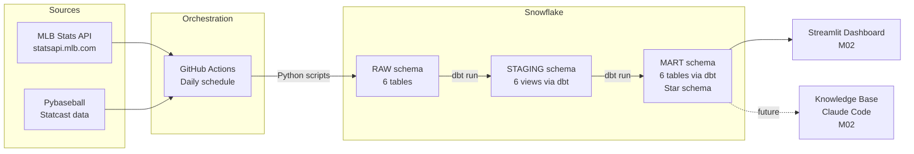

# M01: Extract, Load & Transform — Design Spec

**Date:** 2026-04-21
**Milestone:** M01 (due 2026-04-27)
**Deliverables:** API extraction + Snowflake load, dbt project (staging + mart), GitHub Actions pipeline, pipeline diagram

## Snowflake Object Setup

One-time manual setup via `extract/setup_snowflake.sql`:

- **Database:** `BASEBALL_ANALYTICS`
- **Schemas:** `RAW`, `STAGING`, `MART`
- **Warehouse:** `BASEBALL_WH` (X-Small, auto-suspend 60s)

Environment variables (`.env` locally, GitHub Actions secrets in CI):

| Variable | Value |
|---|---|
| `SNOWFLAKE_ACCOUNT` | Trial account identifier |
| `SNOWFLAKE_USER` | Account username |
| `SNOWFLAKE_PASSWORD` | Account password |
| `SNOWFLAKE_DATABASE` | `BASEBALL_ANALYTICS` |
| `SNOWFLAKE_WAREHOUSE` | `BASEBALL_WH` |

## Extraction Scripts

Six scripts in `extract/`, one per raw table, plus a shared utility. Each script does a full replace for the seasons being loaded.

| Script | Source | Raw Table | What it loads |
|---|---|---|---|
| `players.py` | MLB Stats API | `raw.players` | All MLB players (active + recent). ID, name, position, bats/throws, birth date, debut date, active status |
| `teams.py` | MLB Stats API | `raw.teams` | All 30 MLB teams. ID, name, abbreviation, league, division |
| `games.py` | MLB Stats API | `raw.games` | All games for loaded seasons. Game ID, date, home/away team IDs, venue, final score |
| `game_logs.py` | MLB Stats API | `raw.game_logs` | Per-player per-game batting/pitching lines. AB, H, HR, RBI, BB, K, IP, ER, etc. |
| `season_stats.py` | MLB Stats API | `raw.season_stats` | Per-player per-season batting + pitching totals. AVG, OBP, SLG, ERA, WHIP, K/9, WAR |
| `statcast.py` | pybaseball | `raw.statcast` | Pitch-level Statcast data (exit velocity, launch angle, xwOBA, barrel). Chunked by month to avoid timeouts |
| `utils.py` | — | — | Shared Snowflake connection helper. Reads credentials from env vars |

**Initial scope:** 2024–2025 seasons. Daily GitHub Actions run refreshes current season. Backfill older seasons via manual workflow dispatch with a `seasons` parameter.

**Load strategy:** `CREATE OR REPLACE TABLE` for each run — full replace per season scope. Simple, idempotent, easy to explain.

**Dependencies:** `requirements.txt` with `MLB-StatsAPI`, `pybaseball`, `snowflake-connector-python`, `pandas`, `python-dotenv`.

## dbt Project

**Location:** `dbt/` at repo root. `profiles.yml` lives at `~/.dbt/profiles.yml` locally (not committed — contains connection details). In GitHub Actions, we generate it from secrets at runtime. The dbt project's `dbt_project.yml` references the profile name.

### Staging Models (`dbt/models/staging/`)

One model per raw table — cleaning, renaming, type casting. Materialized as **views**.

| Model | Source | Key transforms |
|---|---|---|
| `stg_players.sql` | `raw.players` | Rename to snake_case, cast dates, deduplicate on player_id |
| `stg_teams.sql` | `raw.teams` | Rename, standardize league/division values |
| `stg_games.sql` | `raw.games` | Rename, cast date, parse score into integers |
| `stg_game_logs.sql` | `raw.game_logs` | Rename, cast numeric stats, add player_type (batter/pitcher) based on which stats are populated |
| `stg_season_stats.sql` | `raw.season_stats` | Rename, cast, add player_type column |
| `stg_statcast.sql` | `raw.statcast` | Rename, cast, filter out null launch events (bunts, etc.) |

### Mart Models (`dbt/models/mart/`)

Four dimensions and two facts. Materialized as **tables**.

**Dimensions:**

| Model | Primary key | Built from |
|---|---|---|
| `dim_players.sql` | `player_id` | `stg_players` |
| `dim_teams.sql` | `team_id` | `stg_teams` |
| `dim_seasons.sql` | `season_year` | `stg_games` (distinct seasons + game counts) |
| `dim_games.sql` | `game_id` | `stg_games` |

**Facts:**

| Model | Grain | Built from | Key columns |
|---|---|---|---|
| `fct_player_game_stats.sql` | One row per player per game | `stg_game_logs` + `stg_statcast` (aggregated to game level) | Traditional box score stats + game-level Statcast averages (avg exit velo, avg launch angle, barrel count, xwOBA) |
| `fct_player_season_stats.sql` | One row per player per season | `stg_season_stats` + `stg_statcast` (aggregated to season level) | Batting: AVG/OBP/SLG/OPS, wRC+, xwOBA, barrel rate. Pitching: ERA/WHIP/K9/FIP. Both: WAR. `player_type` column |

**Statcast aggregation:** `stg_statcast` is aggregated via `GROUP BY` in the fact models (player + game for game facts, player + season for season facts). Business logic lives in the mart, not staging.

### dbt Tests (`schema.yml` per directory)

- **Uniqueness:** primary keys on all models
- **Not null:** all primary keys and foreign keys
- **Accepted values:** `player_type` in (`batter`, `pitcher`), league in (`AL`, `NL`)
- **Relationships:** fact table FKs reference their dimension PKs

## GitHub Actions Pipeline

**Location:** `.github/workflows/extract_load.yml`

**Triggers:**
- **Schedule:** `cron: '0 10 * * *'` (daily at 10 AM UTC / 6 AM ET)
- **Manual:** `workflow_dispatch` with optional `seasons` input (default: current season)

**Single job, sequential steps:**

1. Checkout repo
2. Set up Python 3.11
3. Install dependencies (`pip install -r requirements.txt`)
4. Run `extract/players.py`
5. Run `extract/teams.py`
6. Run `extract/games.py`
7. Run `extract/game_logs.py`
8. Run `extract/season_stats.py`
9. Run `extract/statcast.py`
10. Install dbt (`pip install dbt-snowflake`)
11. Run `dbt run`
12. Run `dbt test`

**Secrets:** `SNOWFLAKE_ACCOUNT`, `SNOWFLAKE_USER`, `SNOWFLAKE_PASSWORD` configured in GitHub repo settings.

**Sequential rationale:** Simpler to explain, easier to debug, respects implicit ordering (teams/players before game logs). Parallel jobs multiply warehouse startup time on free tier.

## Pipeline Diagram

Mermaid diagram in `README.md`:

M02 items (Streamlit, Knowledge Base) shown but marked as future to keep the diagram complete per requirements.
